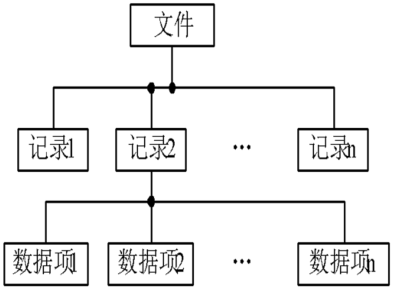
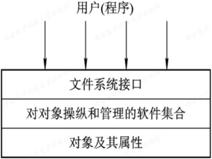
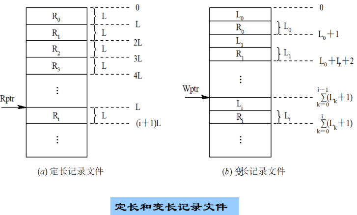
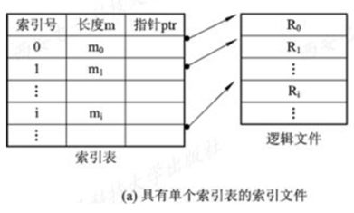
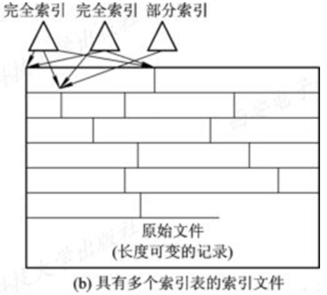
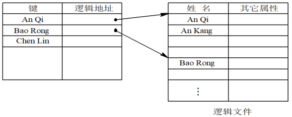
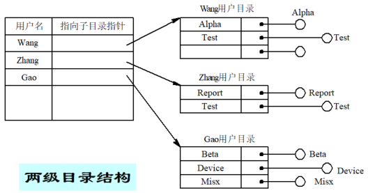
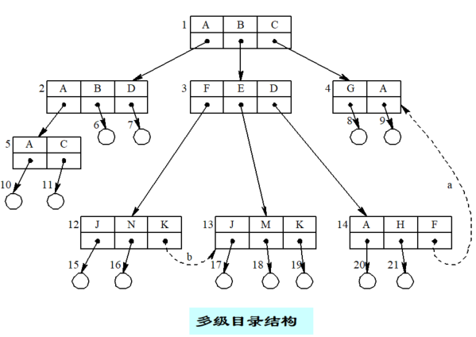
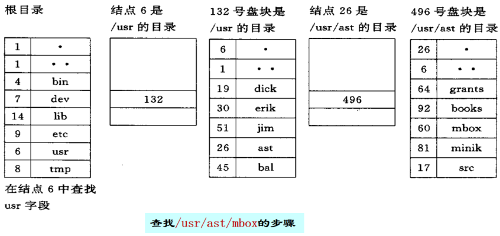

# 7.1 文件和文件系统

> 知识库入口：[00-操作系统基础知识库](00-操作系统基础知识库.md)

> 关联：本章偏文件系统的逻辑抽象；文件的物理块分配、空闲空间管理和磁盘可靠性见[磁盘存储器管理](08-磁盘存储器管理.md)，文件操作的用户入口见[操作系统接口](09-操作系统接口.md)。

## 7.1.1 数据项、记录和文件
### 7.1.1.1 数据项
* **基本数据项**：描述一个对象的某种属性的字符集，是数据组织中可以命名的**最小逻辑数据单位**， 即**原子数据**，又称为数据元素或字段
* **组合数据项**：是由若干个基本数据项组成的，简称**组项**
### 7.1.1.2 记录
* **定义**：是一种相关数据项的集合，用于描述一个对象某方面的属性。其中==关键字==是能唯一标识一个记录的数据项
### 7.1.1.3 文件
* **定义**：指由创建者所定义的、 具有文件名的一组相关元素的集合，可分为**有结构文件**和**无结构文件**两种
* 在有结构的文件中，文件由若干个相关记录组成；而无结构文件则被看成是一个字符流
* 文件在文件系统中是一个**最大的数据单位**，它描述了一个对象集
* 属性：类型、长度、物理位置、存取控制、建立时间
### 7.1.1.4 三者之间的层次关系



## 7.1.2 文件类型
* 按**用途**分类：系统文件、用户文件、库文件
* 按**文件中数据的形式**分类：源文件、目标文件、可执行文件
* 按**存取控制属性**分类：只执行文件、只读文件、读写文件
* 按**组织形式和处理方式**分类：普通文件、目录文件、特殊文件
## 7.1.3 文件系统的层次结构
### 7.1.3.1 对象及其属性
* 文件、目录、磁盘存储空间
### 7.1.3.2 对对象操纵和管理的软件集合
* 文件管理系统的核心部分
功能有：
1. 对**文件存储空间的管理**
2. 对**文件目录的管理**
3. 用于将文件的**逻辑地址转换为物理地址的机制**
4. 对**文件读和写的管理**
5. 对**文件的共享与保护**
其中包括：
* **逻辑文件系统**：记录、文件操作
* **基本 I/O 管理程序**：磁盘空间、缓冲
* **基本文件系统层**：内外存数据交换
* **I/O 控制层**：磁盘驱动
### 7.1.3.3 文件系统接口
* 分为**命令接口**和**程序接口**
### 7.1.3.4 三者间的关系为



## 7.1.4 文件操作
### 7.1.4.1 基本文件操作
* 创建、删除、读写、设置文件的读/写位置
### 7.1.4.2 文件的“打开”和“关闭”操作
* **“打开”**：指系统将指名文件的属性(包括该文件在外存上的物理位置)从外存拷贝到内存打开文件表的一个表目中，并将该表目的编号(或称为索引)返回给用户
* **“关闭”** ：指使用系统调用关闭此文件，OS将会把该文件从打开文件表中的表目上删除
### 7.1.4.3 其他文件操作
* 文件更名、目录操作、属性更改等
# 7.2 文件的逻辑结构
* 文件都有两种形式的结构：**逻辑结构**和**物理结构**
* **逻辑结构**：从用户观点出发所观察到的文件组织形式，即独立于物理特性的用户可直接处理的数据及其结构
* **物理结构**：指文件在外存上的存储组织形式，与存储介质的存储性能、外存分配方式有关
* 文件的逻辑结构和物理结构对文件的检索速度都有影响，故对文件的逻辑结构要求如下：
	1. 提高检索速度
	2. 便于修改
	3. 降低文件存储费用
## 7.2.1 文件逻辑结构的类型
### 7.2.1.1 按文件是否有结构分类
#### 有结构文件：
* 根据记录的长度又可以分为：
	**定长记录**：文件中的记录的长度都相同，文件的长度用记录数目表示，处理方便、开销小
	**变长记录**：文件中的记录的长度不相同，主要原因有：记录包含的数据项数目不同；数据项本身的长度不定
#### 无结构文件：
* 流式文件的长度**以字节为单位**，利用读写指针指出下一个要访问的字符来对其访问，流式文件可以看成是记录式文件的一个特例
### 7.2.1.2 按文件的组织方式分类
* 顺序文件、索引文件、索引顺序文件
## 7.2.2 顺序文件
### 7.2.2.1 顺序文件的排列方式
* **串结构**：记录按存入时间的先后排列，与关键字无关
* **顺序结构**：文件中的记录按关键字排列，故检索效率高
### 7.2.2.2 顺序文件的优缺点
* 对记录批量存取时效率最高
* 对单个记录的查找或修改性能较差，变长记录的顺序文件的开销更大
* 不便于增加或删除记录
## 7.2.3 记录寻址



## 7.2.4 索引文件
### 7.2.4.1 按关键字建立索引



### 7.2.4.2 具有多个索引表的索引文件



 * **索引文件的优缺点**：具有较高的检索速度；提高了存储费用
## 7.2.5 索引顺序文件
* **解释**：是顺序文件和索引文件结合的产物，它将顺序文件的记录分为若干组，并为顺序文件建立一张索引表，表中为每组的第一个记录建立一个索引项，其中包含记录的键值和指向该记录的指针，对于较大的文件可建立多级索引



## 7.2.6 直接文件
- **定义**：直接(存取)文件是指可以**以任意顺序读写任意记录或字节**的文件，而不必从文件开头顺序定位。磁盘上的大多数普通文件都属于直接存取文件。
## 7.2.7 Hash文件
* 和直接文件的查找方式十分相像，但是在 Hash 文件中是利用了 Hash 函数后，再去转换键值之后再去查找的目录表
# 7.3 文件目录
## 7.3.1 文件控制块和索引节点
### 7.3.1.1 文件控制块
* 特点：描述和控制文件的数据结构、与文件一一对应、文件控制块的有序集合是文件目录
* 分类：
	1. 基本信息类：文件名、文件物理位置、文件逻辑结构、文件物理结构
	2. 存取控制信息类：文件的存取权限、核准用户的存取权限、一般用户的存取权限
	3. 使用信息类：文件的建立日期和时间、文件上一次修改的日期和时间、当前使用信息
### 7.3.1.2 索引节点
* **定义**：系统采用将文件名与文件描述信息分开的办法，将文件描述信息单独形成一个数据结构
* 作用：在检索目录时索引节点不用调入内存，从而大大节省了系统开销
* 磁盘的索引节点包含：文件主标识符、文件类型、文件存取权限、文件物理地址、文件长度、文件连接计数、文件存取时间
* 内存索引结点包含：索引结点编号、状态、访问计数、文件所属文件系统的逻辑设备号 、链接指针
## 7.3.2 简单的文件目录
### 7.3.2.1 单级目录结构
* 在整个系统中只建立一张目录表，每个文件占一个目录项，内容包括：文件名、扩展名、文件长度、文件类型、物理地址及其他属性
* 优缺点：简单且可实现按名存取；查找速度慢、不允许重名、不便于实现文件共享。**故单级目录结构只适用于单用户环境**
### 7.3.2.2 两级目录
* 为每个用户建立一个文件目录，此外系统中再建立一个主文件目录，每个用户文件目录在主文件目录中占一个目录项，其目录项包括用户名和指向该用户目录文件的指针



* 优点：提高了检索目录的速度、不同的文件目录中可以使用相同的文件名、不同用户可用不同的文件名访问同一个共享文件
## 7.3.3 树形结构目录
### 7.3.3.1 树形目录



### 7.3.3.2 路径名
* 从主目录开始把全部目录文件名与数据文件名依次用 “ / ” 连接起来便构成该文件的路径名，此路径名又叫绝对路径名
### 7.3.3.3 当前目录（工作目录）
* 从当前目录出发的路径名叫相对路径名
### 7.3.3.4 目录操作
* 创建、删除、改变、移动、链接、查找
## 7.3.4 目录查询技术
### 7.3.4.1 线性检索法



### 7.3.4.2 Hash方法
利用 Hash 方法进行文件名转换时，可能将多个不同的文件名转换为相同的 Hash 值，处理此“冲突”的有效规则是：
1. 在利用 Hash 法索引查找目录时，如果目录表中相应的目录项是空的，则表示系统中并无指定文件
2. 如果目录项中的文件名与指定文件名相匹配， 则表示该目录项正是所要寻找的文件所对应的目录项，故而可从中找到该文件所在的物理地址
3. 如果在目录表的相应目录项中的文件名与指定文件名并不匹配，则表示发生了“冲突”，此时须将其 Hash 值再加上一个常数(该常数应与目录的长度值互质)，形成新的索引值， 再返回到第一步重新开始查找
# 7.4 文件共享
## 7.4.1 基于有向无循环图实现文件共享
* 最常见的实现方式是**硬链接**( Hard Link )
#### 原理
在 Unix/Linux 文件系统中，文件名和文件数据是分离的：
- 磁盘上的文件实体由一个称为 **索引节点( inode )** 的数据结构管理，它记录了文件的所有属性(权限、大小、数据块指针等)，并有一个**链接计数器**
- 目录项只是一个映射，将“文件名”与“ inode 编号”关联起来
硬链接就是**在另一个目录下，创建一个新的目录项，但让它指向同一个 inode 编号**。于是，同一个 inode 就有了多个名字(多个父目录)，链接计数器会相应增加
``` text
目录 /home/user1:
  report.txt  →  inode 1005 (链接计数=2)

目录 /home/user2:
  shared_report →  inode 1005 (链接计数=2)
```
## 7.4.2 利用符号链实现文件共享
* **符号链接**：该方式下，用户想共享一个文件时，系统为其创建一个 **LINK 类型的新文件**，新文件中包含被链接文件的路径名
* **符号链**：新文件中的路径名
* 优点：可用于计算机网络，通过网络地址及文件在机器中的路径实现文件的链接和共享
* 缺点：每次访问共享文件都要多次读盘，系统开销较大
# 7.5 文件保护
* 影响文件安全性的主要因素有：人为、系统、自然
* 采取措施：**通过存取控制机制**，防止由人为因素所造成的文件不安全性；**采取系统容错技术**，防止系统部分的故障所造成的文件的不安全性；**建立后备系统**，防止由自然因素所造成的不安全性
