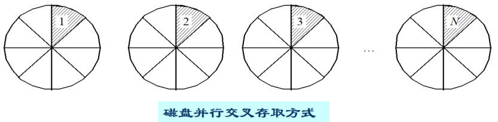
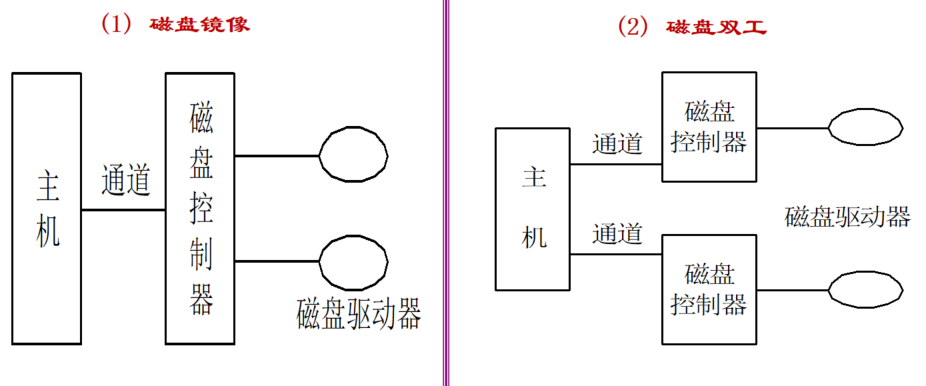

* 磁盘存储器管理的**主要任务**：有效地利用存储空间、提高磁盘的 I/O 速度、提高磁盘系统的可靠性

> 知识库入口：[00-操作系统基础知识库](00-操作系统基础知识库.md)

> 关联：本章解释[文件管理](07-文件管理.md)中的文件和目录最终如何落到磁盘块上；磁盘请求的调度过程可回看[输入输出系统](06-输入输出系统.md#6.8%20磁盘存储器的性能和调度)。

# 8.1 外存的组织方式
## 8.1.1 连续组织方式
* 为每一个文件**分配一组连续的磁盘物理块**。一般情况下，这些盘块都集中于一个(或有限几个)磁道上，访问时一般无需移动(或无需频繁移动)磁头
* 优点：顺序访问容易，顺序访问速度快
* 缺点：要求有连续的存储空间，必须事先知道文件的长度，插入删除记录不灵活，不便于文件动态增长
## 8.1.2 链接组织方式
* **隐式链接**：文件目录中的每个目录项都包含指向链接文件第一个盘块和最后一个盘块的指针，因而**只适应于顺序访问**，对**随机访问是极其低效**的，并且**可靠性很差**
* **显式链接**：把用于链接文件各物理块的指针，显式地存放在**内存的一张链表**中，即整个磁盘仅有一张表，称为**文件分配表( FAT )**，虽然这种方式查找速度快，但是不能支持高效的直接存储而且 FAT 需要占用较大的内存空间
## 8.1.3 索引组织方式
### 8.1.3.1 单级索引分配
* 核心思想：**为每个文件分配一个索引块(表)，把分配给该文件的所有盘块号都记录在该索引块中**，因而该索引块就是一个包含许多盘块号的数组，建立文件时，就在文件的目录项中填上指向该索引块的指针
* 特点：支持直接访问、不产生外部碎片、外存空间浪费
### 8.1.3.2 多级索引分配
* 当文件规模较大时，为它分配的索引块就不止一个，因而就可以建立多级索引，很类似内存中的多级分配模式
### 8.1.3.3 混合分配方式
* **核心思想**：将多种分配方式相结合而形成的一种分配方式。既可采用直接分配又可采用索引分配。对不同的部分进行的分配方式也不一样
# 8.2 文件存储空间的管理
## 8.2.1 空闲表法和空闲链表法
* 分配：空闲盘区的分配与内存的动态分配类似，同样是采用**首次适应算法**、**循环首次适应算法**等
* 回收：采取类似于内存回收的方法， 即要考虑回收区是否与空闲表中插入点的前区和后区相邻接，对相邻接者应予以合并
- **空闲链表法**：每个空闲块都存着下一个空闲块的指针。分配/回收都要读盘遍历，极慢
- **空闲表法（连续分配)**：用一张表记录所有连续空闲区，不适合离散分配
## 8.2.2 位示图法
* **解释**：操作系统管理磁盘空闲空间的一种经典方法，它用一个比特位( 0 或 1 )来表示磁盘上每个物理块是否空闲
### 8.2.2.1 核心思想
* 用“一串二进制位”给磁盘画地图
- 磁盘的每个物理块，在位示图上对应**1个比特( bit )**
### 8.2.2.2 数据结构
位示图本质上是一个 `m × n` 的二维位矩阵，但在磁盘和内存中是连续存放的，可以看作一个字节数组
```
位示图（示意图，1表示已占用，0表示空闲）：
      块0 块1 块2 块3 ... 块n-1
字0:  [ 1   0   0   1  ...  0  ]
字1:  [ 0   1   1   0  ...  1  ]
...
字m-1:[ 1   0   0   0  ...  0  ]
```
### 8.2.2.3 盘块号 ↔ 位示图的映射
这是位示图法中唯一需要记住的计算。给定一个磁盘块号 `b`，我们要知道它在位示图中第几个字的第几位
**设**：
- 位示图由 `m` 个字组成，每个字 `n` 位(比如 16 位或 32 位)
- 磁盘块号从 `0` 开始
#### 从盘块号 `b` 找它在位示图中的位置
```
字序号 i = b / n      （整除）
位序号 j = b % n      （取余）
```
#### 从位示图位置 `(i, j)` 找回盘块号
```
盘块号 b = i × n + j
```
这个双向映射是位示图操作的基础。
### 8.2.2.4 核心操作：分配与回收
#### 分配一个空闲块
1. 在位示图中顺序查找，找到第一个值为 `0` 的位
2. 设该位位于第 `i` 字，第 `j` 位
3. 将该位由 `0` 改为 `1`(标记为已占用)
4. 计算盘块号：`b = i × n + j`
5. 返回盘块号 `b`
#### 回收一个盘块
1. 拿到待回收的盘块号 `b`
2. 计算其位置：`i = b / n`，`j = b % n`
3. 将位示图中第 `i` 字第 `j` 位由 `1` 改为 `0`(标记为空闲)
### 8.2.2.5 位示图的优缺点

| 优点             | 解释                                           |
| -------------- | -------------------------------------------- |
| **空间开销极小**     | 1 个块只占 1 个 bit。比如 1TB 磁盘，块大小 4KB，位示图仅需约 32MB |
| **可快速找到连续空闲块** | 位图天然适合按“字”为单位扫描，找一个全 0 的字或连续 0 位很容易          |
| **操作原子性友好**    | 改变一个比特是极快的操作，容易实现不被打断的原子修改                   |
| **可同时驻留内存**    | 因体积小，整个位图通常可以全部放入内存，分配和回收都不需要磁盘 I/O          |

| 缺点             | 解释                                                 |
| -------------- | -------------------------------------------------- |
| **大磁盘时线性扫描变慢** | 虽然可以按字跳查，但极端碎片化时仍需大量扫描。现代系统会配合其他策略(如记录上次分配的位置)     |
| **位图自身一致性要求高** | 位图损坏会导致整个文件系统的空闲空间信息丢失。因此位图通常配合日志(journal)或复制备份来保护 |
## 8.2.3 成组链接法
* 成组链接法的设计目标就是：用极小的内存(一个数组)，就能快速操作大量离散的空闲块，同时避免为每个空闲块维护指针的 I/O 开销
### 8.2.3.1 核心思想
**把全部空闲块分成若干组，每组的第一个块充当“索引块”，存放下一组所有空闲块的块号。**
- 所有空闲块的数量和块号按组串联起来，形成一个单向链表
- 但是，**并不是每次都去读盘上的索引块**。内存中始终保留一个当前活动组的索引表，这样绝大部分分配和回收都可以在内存中完成，不需要读写磁盘
### 8.2.3.2 数据结构
* 内存中的这块索引表称为**空闲块栈( free block stack )**，存放在文件系统的超级块中。它有两个关键成员：
```
int  s_nfree;           // 当前栈中的空闲块数（栈顶指针）
int  s_free[100];       // 栈数组，最多存100个空闲块号
```
栈的工作方式：
- **分配时**：弹出栈顶块号（`s_free[--s_nfree]`）
- **回收时**：把回收的块号压入栈顶（`s_free[s_nfree++] = b`）
那“成组”和“链接”体现在这个栈的**最后一个元素**上
### 8.2.3.3 链接机制
空闲块栈的逻辑结构如下(假设每组最多100块)：
```
内存栈（当前组）：
  s_free[0]  ← 下一组索引块号（如果当前组不是最后一组）
  s_free[1]
  ...
  s_free[s_nfree-1]  ← 可分配的空闲块号
```
**规则**：
- 栈中 `s_free[0]` 存放的是**下一组索引块的块号**(仅当本组不是最后一组时)
- `s_free[1]` 到 `s_free[s_nfree-1]` 是当前组可直接分配的空闲块号
- 每组的索引块本身也是一个空闲块，但它的数据区存放的是下一组的块号表和块数
**特殊情况——最后一组**：
最后一组索引块中存放的下一组块号为 **0** (表示链尾)，且该组栈可能不满(`s_nfree < 100`)
### 8.2.3.4 操作过程详解
#### 分配一个空闲块
1. 如果 `s_nfree > 1`(栈中还有可分配块)：
   - 直接弹出栈顶：`b = s_free[--s_nfree]`
   - 返回 `b`
2. 如果 `s_nfree == 1`(栈中只剩一个元素，即下一组索引块号)：
   - `b = s_free[0]`，这是下一组索引块的块号
   - 如果 `b == 0`，则无空闲块，分配失败
   - 否则，把索引块 `b` 的**数据读入内存栈**：  
> 读入后，该块数据区的第一部分是下一组的块数(存入 `s_nfree` )，紧接着是下一组的块号表( 存入 `s_free[]` )

   - 最后，把索引块 `b` 本身也分配出去(因为它现在是空闲的，内容已移到内存)
   - 返回 `b`
#### 回收一个块
1. 如果 `s_nfree < 100`(栈未满)：
   - 把回收的块号压入栈顶：`s_free[s_nfree++] = b`
   - 完成
2. 如果 `s_nfree == 100`(栈已满，当前组已满)：
   - 把当前内存栈的**全部内容(100个块号)写到回收块 `b` 中**，作为新的一组索引块
   - 清空内存栈：`s_nfree = 1`
   - 把回收块 `b` 的块号存入 `s_free[0]`(作为新组的索引块号)
   - 这样，回收块 `b` 就成了新组的索引块，而内存栈重新变空，可以继续接受回收
### 8.2.3.5 与其他方法对比

| 特性      | 空闲链表         | 位示图             | 成组链接             |
| ------- | ------------ | --------------- | ---------------- |
| 内存占用    | 极小(只记录链表头)   | 大(全盘块的 1bit /块) | 极小(仅一个栈约 400 字节) |
| 分配/回收速度 | 慢(需读写盘上每个节点) | 快(内存位操作)        | 快(绝大部分在内存栈操作)    |
| 连续块分配   | 困难           | 容易(扫描连续 0 )     | 较容易(可扫描栈中块号)     |
| I/O 频率  | 每次操作都可能有 I/O | 启动时读入，写回时批量     | 仅在组切换时发生 I/O     |
| 适用场景    | 简单系统         | 多数现代通用 FS       | 经典 UNIX ，需节省内存   |
# 8.3 提高磁盘I/O速度的途径
## 8.3.1 磁盘高速缓存（Disk Cache）
* **定义**：是一组在逻辑上属于磁盘而物理上是驻留在内存中的盘块
### 8.3.1.1 两种形式
1. 在内存中开辟一个单独的存储空间来作为磁盘高速缓存，其大小是固定的，不会受应用程序多少的影响
2. 把所有未利用的内存空间变为一个缓冲池，供请求分页系统和磁盘 I/O 时(作为磁盘高速缓存)共享
### 8.3.1.2 数据交付方式
* **数据交付**：直接将高速缓存中的数据，传送到请求者进程的内存工作区中
* **指针交付**：指向高速缓存中某区域的指针，交付给请求者进程
>后一种方式由于所传送的数据量少，因而节省了数据从磁盘高速缓存存储空间到进程的内存工作区的时间
### 8.3.1.3 置换算法
>由于请求调页中的联想存储器与高速缓存(磁盘 I/O 中)的工作情况不同，因而使得在置换算法中所应考虑的问题也有所差异
* 设计考虑：最近最久未使用、访问频率、可预见性、数据的一致性
### 8.3.1.4 周期性地写回磁盘
主要是为了防止突发时间的发生导致数据丢失
## 8.3.2 提高磁盘I/O速度的其它方法
* **提前读**：访问当前块时，将下一块中的内容也提前读进来
* **延迟写**：存储在系统缓冲区中的内容延缓写回磁盘，直到该缓冲区要被重新访问为止
* **优化物理块分布**：采用同磁道分配或簇技术
* **虚拟盘**：内存空间仿真磁盘，又称 RAM 盘(用户控制内容)
## 8.3.3 独立磁盘冗余阵列（RAID）
### 8.3.3.1 并行交叉存取
* 系统中设有多台磁盘驱动器，系统将一个盘块的数据分为若干的子盘块，将每个子盘块的数据分别存储到不同磁盘的相同位置上，若将一个盘块的数据传送到内存，系统可采取**并行传输方式**，将各个盘块的子盘块数据同时传入内存，从而大大减少传输时间



### 8.3.3.2 RAID分级
1. RAID 0级 (无冗余校验)
2. RAID 1级 (镜像盘）
3. RAID 3级 (一个奇偶校验盘)
4. RAID 5级
5. RAID 6级和RAID 7级
### 8.3.3.3 RAID优点
* 可靠性高、磁盘I/O速度高、性价比高
# 8.4 提高磁盘可靠性的技术
## 8.4.1 SFT-I
**核心目的**：防止因磁盘盘面的**局部物理损坏**(如划伤、磁介质脱落)导致数据永久丢失
**关键机制**：
1.  **写后读验证**
    系统每次将数据写入磁盘后，立即从磁盘读回，并与内存中的原始数据逐字节比较
    - 如果一致，说明写入成功，内存中的写缓存可以释放
    - 如果**不一致**，则判定目标扇区已物理损坏
2.  **热修复**
    - 磁盘上划出一小部分空间(约占磁盘容量的 2%)，称为**热修复重定向区**
    - 当写后读验证发现某块(扇区)写入失败时，系统将该块标记为“坏块”，不再使用
    - 同时，将原本要写入坏块的数据，**重定向**写入热修复区中一个空闲的块
    - 重定向信息记录在系统内部的一个映射表中，以后对该坏块的读写请求都会被自动转向热修复区
## 8.4.2 SFT-II：防范磁盘驱动器整体故障
**核心目的**：保护数据不因**整块磁盘或磁盘控制器**的彻底失效而丢失。
SFT-II 提供了两种保护级别：
### 8.4.2.1 磁盘镜像
- **结构**：两块容量相同的磁盘连接在**同一个磁盘控制器**上
- **数据分布**：NetWare 将同一份数据**同时写入这两块盘**，两块盘存储的内容完全相同，互为镜像
- **故障处理**：当工作盘（主盘）故障时，系统自动切换到镜像盘继续运行，不中断服务
- **局限性**：因为两块盘共享一个控制器，如果**控制器坏了**，两块盘都无法访问，系统仍会崩溃
### 8.4.2.2 磁盘双工
- **结构**：两块磁盘分别接在**两个独立的磁盘控制器**上
- **优势**：不仅保护了磁盘，还保护了控制器和连接电缆。任何一个控制器、一条电缆或一块磁盘损坏，系统都能靠另一路独立通道继续工作
- **性能**：由于有两个控制器，写操作仍需等待双方完成，但**读操作**可以智能分配(从响应更快的那块盘读取)，从而提高读取性能
- **这是 SFT-II 的更高实现**，比纯镜像更可靠



## 8.4.3 对比

| 容错级别 | 防范的故障 | 核心机制 | 硬件要求 | 对应现代概念 |
|:---|:---|:---|:---|:---|
| **SFT-I** | 磁盘表面局部缺陷 | 写后读验证 + 热修复重定向 | 无特殊要求 | 现代硬盘坏块重映射、文件系统数据校验 |
| **SFT-II** | 磁盘驱动器故障、控制器故障 | 磁盘镜像 / 磁盘双工 | 双盘、双工需双控制器 | RAID 1 |
