# 4.1 存储器的层次结构

> 知识库入口：[操作系统基础知识库](操作系统基础知识库.md)

> 关联：本章是[虚拟存储器](5.虚拟存储器.md)的基础，分页、分段和段页式管理会在请求分页、缺页中断、页面置换中继续使用。

## 4.1.1 多层结构的存储器系统
### 4.1.1.1 存储器的多层结构
存储层次至少应该具有三级：最高层为 CPU 寄存器，中间为主存，最底层是辅存
按照功能细分为：
* CPU 寄存器：寄存器
* 主存：高速缓存、主存储器、磁盘缓存
* 辅存：固定磁盘、可移动存储介质
>辅存：CPU 不能直接访问，属于设备管理

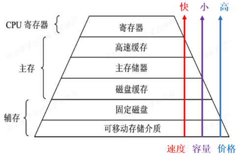

### 4.1.1.2 可执行存储器
在计算机系统的存储层次中，寄存器和主存储器又被称为可执行存储器。
在访问中将涉及到中断、设备驱动程序以及物理设备的运行，所需耗费的时间远远高于访问可执行存储器的时间，一般相差 3 个数量级甚至更多。
## 4.1.2 主存储器与寄存器
### 4.1.2.1 主存储器
* **定义**：计算机系统中的主要部件，用于保存进程运行时的程序和数据，也称可执行存储器、内存、主存
### 4.1.2.2 寄存器
* **定义**：具有与处理机相同的速度，故对寄存器的访问速度最快，完全能与 CPU 协调工作，但价格却十分昂贵，因此容量不可能做得很大
## 4.1.3 高速缓存和磁盘缓存
### 4.1.3.1 高速缓存（物理上独立存在）
* **定义**：介于寄存器和存储器之间的存储器，主要用于备份主存中较常用的数据，以减少处理机对主存储器的访问次数，这样可大幅度地提高程序执行速度
### 4.1.3.2 磁盘缓存(物理上属于主存)
* **定义**：用于暂时存放频繁使用的一部分磁盘数据和信息，以减少访问磁盘的次数

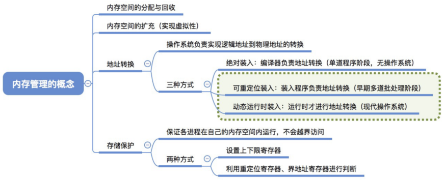

# 4.2 程序的装入和链接
程序运行前一般经历：编译 -> 链接 -> 装入。
- 编译：源代码变成目标模块。
- 链接：目标模块和库函数合成装入模块。
- 装入：把装入模块放入内存。
## 4.2.1 程序的装入
### 4.2.1.1 绝对装入方式
* **解释**：完全按照目标程序中所给定的地址装入内存，即目标程序中使用的是绝对地址
>该绝对地址要么由程序员设计程序时给定，要么程序员编程时采用符号地址，然后由编译程序或汇编程序转换成绝对地址
### 4.2.1.2 可重定位装入方式
* **解释**：根据内存目前的使用情况，将装入模块装入到内存的某个位置
>在多道程序系统中，由于用户的目标程序地址往往都是从 0 开始的，而程序中的其它地址也往往用相对地址形式表示，因此只能采用可重定位装入方式
* **重定位**：装入时对目标程序中的指令地址和数据地址的修改过程
* **静态重定位**：如果重定位是在装入时由装入程序一次性完成的(装入后不再改变)
**静态重定位缺点**：
- 不允许目标程序运行时在内存中移动位置
- 不允许程序运行时动态扩充内存
### 4.2.1.3 动态运行时装入方式（动态重定位）
* **解释**：动态运行时的装入程序，在把装入模块装入内存后，并不立即把装入模块中的相对地址转换为绝对地址，而是把这种地址转换推迟到程序真正要执行时才进行。因此， 装入内存后的所有地址仍是相对地址
对于此种方式有专门的硬件机构解决(重定位寄存器)
## 4.2.2 程序的链接
### 4.2.2.1 静态链接
* **解释**：在程序运行之前，先将各目标模块及它们所需的库函数链接成一个完整的装入模块，以后不再拆开
### 4.2.2.2 装入时动态链接
* **定义**：将用户源程序编译后所得到的一组目标模块，在装入内存时，采用边装入边链接的链接方式
* **解释**：在装入一个目标模块时，若发生一个外部模块调用事件，将引起装入程序去找出相应的外部目标模块，并将它装入内存
* **优点**：便于修改和更新；便于实现对目标模块的共享
### 4.2.2.3 运行时动态链接
* **解释**：在许多情况下，应用程序在运行时，每次要运行的模块可能是不相同的。所以在程序运行到某模块时才链接它，没用到就不装
# 4.3 连续分配存储管理方式

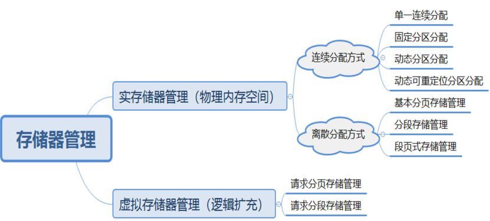

## 4.3.1 单一连续分配
* 最简单的一种存储管理方式，但只能用于==单用户、单任务的操作系统==中
* 把内存分为**系统区和用户区**两部分，系统区仅提供给 OS 使用，通常是放在内存的==低址部分==；用户区是指除系统区以外的全部内存空间， 提供给用户使用
## 4.3.2 固定分区分配
* **定义**：将内存用户区分成若干个固定大小的区域，每个区域内驻留一道程序，一旦内存中空闲一个分区，即从外存后备队列中调度一个作业进来运行
### 4.3.2.1 分区的划分方法
* **大小相等**：该方式一般用于一台计算机控制多个相同对象的情况
* **大小不等**：该方式可适用于大小不等的多个作业运行
### 4.3.2.1 内存分配
* 通常将分区按其大小进行排队，并为之建立一张分区使用表，其中各表项包括每个分区的起始地址、大小及状态(是否已分配)
## 4.3.3 动态（可变式）分区分配
可变分区中分区的大小及数目都是可变的，可根据用户需要动态分配
* **实现**：解决分区分配中==所用的数据结构==、分区==分配算法==和分区的==分配回收==等问题
### 4.3.3.1 数据结构
* **空闲分区表**：属性及其含义与固定分区使用表相同
* **空闲分区链**：在每个分区的起始部分和末尾部分分别设置两个指针域，将所有空闲分区构成双向链表
### 4.3.3.2 分区分配操作
* 分配内存：

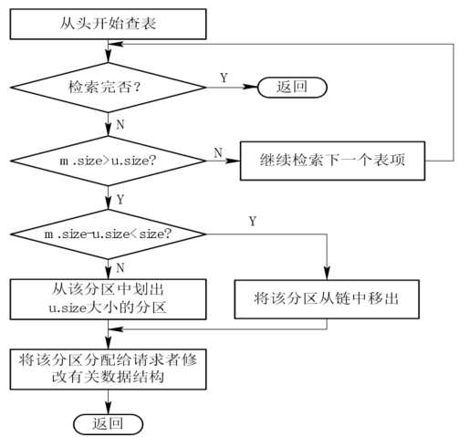

* 回收内存：
当进程运行终止时，势必引起内存的释放，一般可分成下面四种情况：
1. 回收区与插入点前一个分区相连接             a
2. 回收区与插入点后一个分区相连接             b
3. 回收区与插入点前、后两个分区相连接      c
4. 孤立回收区

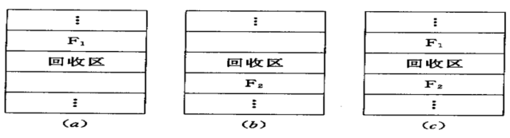

## 4.3.4 基于顺序检索的分区分配算法
* **最先(首次)适应法**：一个作业到达时，从空闲分区(链)表中顺序检索出尺寸能满足要求且未分配的分区，然后按照作业大小从该分区中划分出一块内存空间分配给它，余下的空闲分区仍然保留
>特点：保留高址部分大分区，低址部分碎片多，查找开销大
* **循环首次适应法**：由首次适应法演变而来，只不过从上一次的空闲分区开始查找
>特点：分区分布均匀，缺乏大分区
* **“最佳”适应法**：一个作业到达时，即从空闲分区(链)表中检索出尺寸能满足要求且未分配的最小分区分配给它
>特点：碎片最小，如果剩余空闲分区太小，则将整个分区全部分配给它
* **“最坏”适应法**：一个作业到达时，即从空闲分区(链)表中检索出尺寸能满足要求且未分配的最大分区分配给它
>特点：碎片最大，但剩余的空闲分区可再次使用
## 4.3.5 基于索引检索的分区分配算法 
### 4.3.5.1 快速适应算法（分类搜索法）
- **解释**：进程对内存空间的申请往往有很强的**规律性**。快速适应算法正是利用了这一特性：**将空闲分区按大小进行极其细致的分类，为每一种常用大小的分区都设立一个单独的空闲分区链表**
#### 优点
- **速度奇快( $O(1)$ )**：在分配常用大小的空间时，既不需要遍历链表(如首次适应)，也不需要现场切分(如伙伴系统)，直接一键取用。
- **绝无内部碎片**：因为每个链表里的块大小都是精准匹配请求的，分出去多大就是多大，不存在空间浪费
#### 缺点
- **外部碎片严重**：这是该算法最大的痛点。因为各个链表之间的空间是**完全隔离**的，会造成空间浪费
- **内存不合并**：为了追求极致的回收速度，该算法在回收时**不进行空闲分区的合并**，只有在系统内存极度紧张时，才会触发全局的主动合并
### 4.3.5.2 伙伴系统
* **定义**：将**二分法**与**链表索引**相结合的内存分配算法。它在速度和碎片控制之间取得了很好的平衡
#### 核心思想
- 系统的所有空闲分区大小必须是 **2 的幂次方**(例如 $2^0, 2^1, 2^2, \dots, 2^n$ KB )
- 无论分配还是回收，分区都会按照“一分为二”或“合二为一”的原则进行。这两个由同一个大分区切出来的、大小相等的邻近分区，互称为“伙伴”( Buddy )
#### 索引结构
系统维护一个**空闲分区链表数组**。数组的每个索引对应一种大小的空闲块链表：
- 索引 0 $\to$ 大小为 $1 \text{ KB } ( 2^0 )$ 的空闲块链表
- 索引 1 $\to$ 大小为 $2 \text{ KB } (2^1)$ 的空闲块链表
- 索引 2 $\to$ 大小为 $4 \text{ KB } (2^2)$ 的空闲块链表
- ...以此类推。
#### 优缺点总结
- **优点**：快速。通过计算二进制和索引，能极快地定位空闲块或合并伙伴
- **缺点**：存在**内部碎片**。比如申请 129 KB 的空间，系统必须分配 256 KB，浪费了 127 KB
### 4.3.5.3 哈希算法
哈希算法利用了数据结构中散列表的思想，旨在实现 **$O(1)$ 时间复杂度** 的极速查找
#### 核心思想
- 改变了传统算法“沿着链表一个个挨着找(遍历)”的低效方式
- 通过一个**哈希函数**，直接根据用户请求的**分区大小**，计算出一个对应的**哈希表索引**
#### 优缺点总结
- **优点**：检索效率极高，分配和回收开销非常平稳，不受系统空闲块数量多少的影响
- **缺点**：如果哈希函数设计不当，可能会导致某些槽位( Slot )下的链表过长(哈希冲突)，退化为线性查找
## 4.3.6 动态可重定位分区分配
* **碎片**：在连续分配方式中，随分配过程的不断进行，内存中产生的尺寸较小的自由分区
### 4.3.6.1 动态重定位
* “拼接”后的程序在内存中的位置发生了变化，为能正确执行程序，必须对程序中的地址部分作动态调整
* 硬件层面：**设置一个动态重定位寄存器，用于存储程序在内存中的起始地址**
* **转换过程**：
1. 取出有效指令中的地址部分 A
2. 让 A 与重定位寄存器中的地址 S 相加
3. A 与 S 之和就是本次要访问的目标地址
### 4.3.6.2 算法流程图

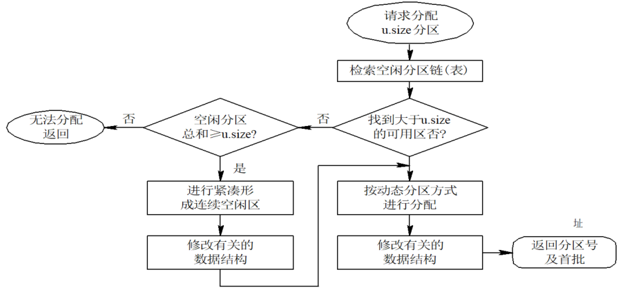

# 4.4 对换
* **定义**：把内存中暂时不能运行的进程或者暂时不用的程序和数据，调出到外存上，以便腾出足够的内存空间，再把已具备运行条件的进程或进程所需要的程序和数据，调入内存
* 是提高内存利用率的有效措施
* **对换类型**：整体对换(进程)；部分对换(页、段)
## 4.4.1 对换空间管理
* 包括**对内存和外存**的管理。外存分为文件区和对换区，目标不同，管理方式不同
>文件区：强调外存利用率，采用离散分配
>对换区：强调访问效率，采用连续分配(与内存的动态分区连续分配相似，回收时需考虑分区的合并)
## 4.4.2 进程的换出与换入
* **换出**：有阻塞或睡眠状态的进程、进程的优先级、进程在内存中的驻留时间等。无阻塞进程则考虑优先级低的就绪进程
* **换入**：换入“就绪且换出状态”的进程
* **常用的对换方案**：
>处理机正常运行时并不启动对换程序，若许多进程运行时缺页率上升、内存紧张方启动对换程序，将一部分进程调至外存。若发现所有进程的缺页率已明显减少 ，且系统吞吐量下降，则可暂停运行对换程序
# 4.5 分页存储管理方式
## 4.5.1 基本方法
### 4.5.1.1 页面和物理块
* **页面**（页)：将一个进程的逻辑地址空间分成的若干个大小相等的片，并为各页从 0 开始加以编号
* **(物理)块**：把内存空间分成与页面相同大小的若干个存储块， 也为它们加以编号
* **页内碎片**：进程的最后一页经常装不满一块而形成了不可利用的碎片
* 页面大小应该适中且是 $2^n$ 
### 4.5.1.2 地址结构

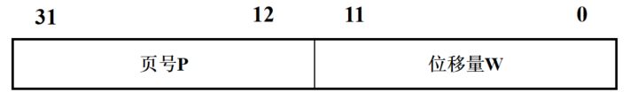

给一个逻辑地址空间中的地址为A，页面的大小为L，则页号 P 和页内地址 d 可按下式求
$$P = INT \left[ \frac{A}{L} \right]$$
$$d = [ A ] \, MOD \, L$$
### 4.5.1.3 页表
* 用来映射用户程序中的页号(逻辑地址)到内存中的块号(物理地址)
## 4.5.2 地址变换机构
### 4.5.2.1 基本的地址变换机构

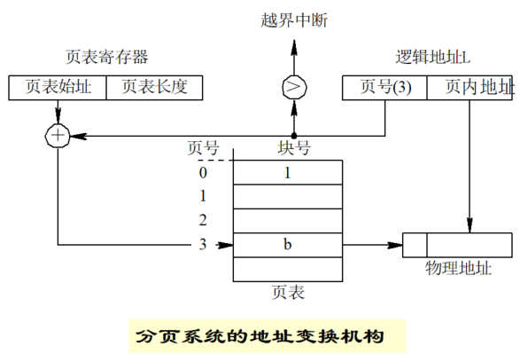

### 4.5.2.2 具有快表的地址变换机构

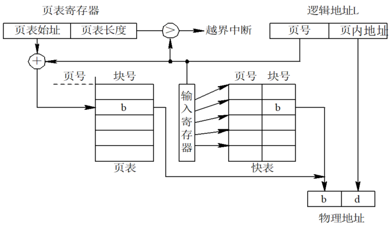

## 4.5.3 访问内存的有效时间
* **定义**：从进程发出指定逻辑地址的访问请求，经过地址变换，到在内存中找到对应的实际物理地址单元并取出数据，所需要花费的总时间
* 简单来说就是：查页表时间 + 查物理地址时间
>通过快表查询，可以直接得到逻辑页所对应的物理块号，由此拼接形成实际物理地址，**减少了一次内存访问**，缩短了进程访问内存的有效时间。但是快表的**容量限制**，不可能将一个进程的整个页表全部装入快表
* **命中率**：指使用快表并在其中成功查找到所需页面的表项的比率
* 引入快表之后的公式：$2 t + λ - t × а$
>λ：查找快表所需要的时间；а：命中率；t：访问一次内存所需要的时间
## 4.5.4 两级页表

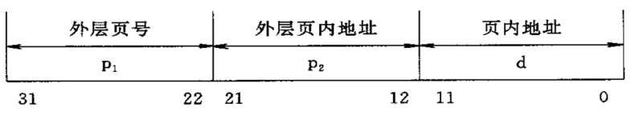

* 地址变换机构：

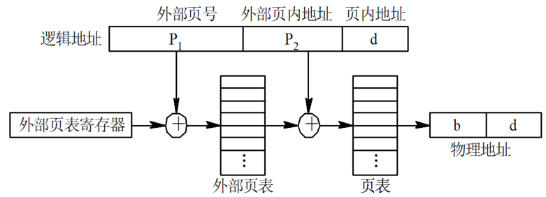

* 若地址空间很大，则可采用三级及三级以上页表结构
# 4.6 分段存储管理方式
## 4.6.1 分段存储管理的优点
* **方便编程（模块化程序设计)**：通常一个作业由若干个程序段构成，每个段都有独立的名字，并且都从 0 开始编址，而在调用时都是按照段名和段内位移量(段内地址)进行访问
* **信息共享**：程序和数据的共享往往以信息的逻辑单位为基础，==分页中信息并不完整，因而不便于实现共享==
* **分段保护**：是以信息的逻辑单位为基础的，而且经常是以一个过程、函数或文件为基本单位进行保护的
* **动态链接**：易于实现在程序执行时进行的动态链接
* **动态增长**：适合程序运行过程中的动态空间的申请
## 4.6.2 基本原理
### 4.6.2.1 段结构

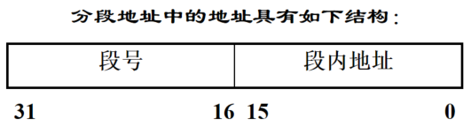

### 4.6.2.2 段表映射

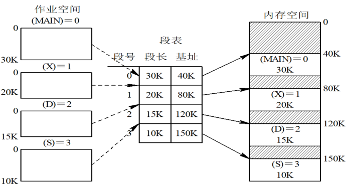

### 4.6.2.3 地址变换机构

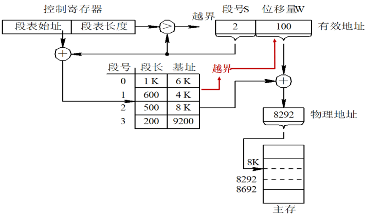

### 4.6.2.4 分页和分段的主要区别
* 页是信息的**物理单位**，分页是由于系统管理的需要而不是用户的需要。段则是信息的**逻辑单位**，分段的目的是为了能更好地满足用户的需要
* 页的大小固定且由系统决定；而段的长度却不固定， 取决于用户所编写的程序
* 分页的作业地址空间是一维的，即**单一的线性地址空间**； 而分段的作业地址空间则是**二维的**
## 4.6.3 段页式存储管理方式
* **基本原理**：程序分段，段内分页

此种方式的准备：
* 硬件上仍旧保证段表地址寄存器和加法器
 * 为每个进程设置一张段表，属性包括(段号，状态，页表大小，页表始址)
 * 为每个段设置一张页表，属性包括(页号，状态，存储块号)
 
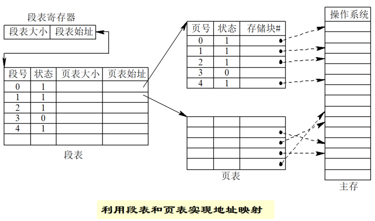

 
