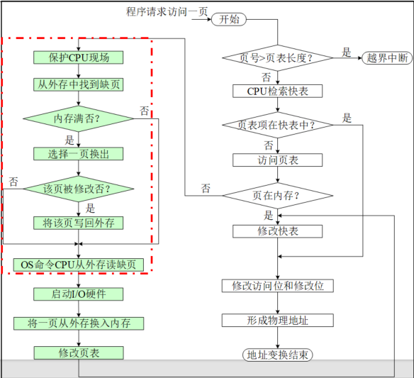
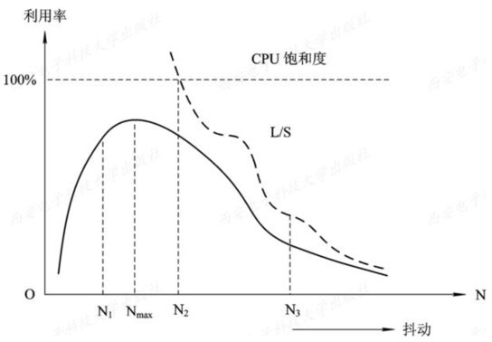
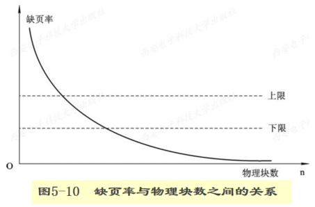
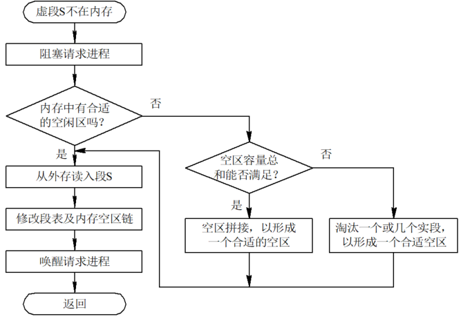
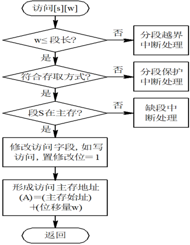
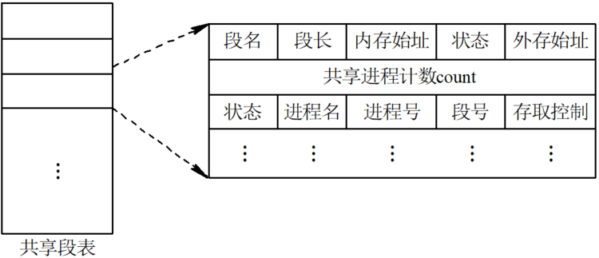
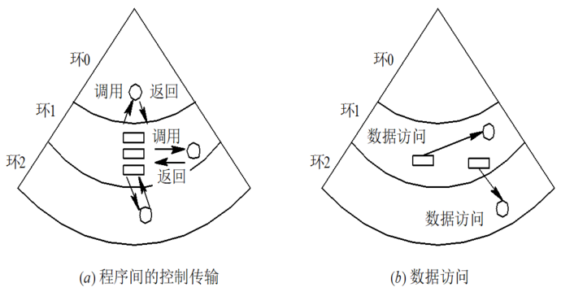

# 5.1 虚拟存储器概述

> 知识库入口：[操作系统基础知识库](操作系统基础知识库.md)

> 关联：虚拟存储器建立在[存储器管理](4.存储器管理.md)的离散分配机制上，缺页调入和页面换出又依赖[输入输出系统](6.输入输出系统.md)与[磁盘存储器管理](8.磁盘存储器管理.md)。

## 5.1.1 引入
### 5.1.1.1 常规存储器管理方式的特征
* **一次性**：作业必须**一次性全部**装入内存后方能正常运行
* **驻留性**：装入内存的作业在其运行完毕之前**永久驻留内存**
以上特点导致了：**大作业无法运行**、**大量作业无法并发**
### 5.1.1.2 局部性原理
* 程序执行时， 除了少部分的转移和过程调用指令外， 在大多数情况下仍是**顺序执行**的(产生了==空间局限性==)
* 过程调用将会使程序的执行轨迹由一部分区域转至另一部分区域， 但经研究看出，过程调用的深度在大多数情况下都**不超过 5**
* 程序中存在许多**循环结构**， 这些虽然只由少数指令构成， 但是它们将多次执行(产生了==时间局限性==)
* 程序中还包括许多对**数据结构**的处理， 如对数组进行操作， 它们往往都局限于很小的范围内
## 5.1.2 定义与特征
* **定义**：仅把作业的一部分装入内存便可运行的存储器系统，具体说就是指具有**请求调入功能**和**置换功能**，能从逻辑上对内存容量进行扩充的一种存储器系统
* **特征**：
	1. 离散性：即非连续性，这是实现的技术前提
	2. 多次性：一个作业被分成多次调入内存
	3. 对换性：允许作业运行过程中换入、换出
	4. 虚拟性：能够从逻辑上扩充内存容量
## 5.1.3 实现方法
* 在请求分页系统中：
在基本分页管理方式基础上，在作业调度时，仅将部分页面装入内存，在运行过程中，陆续把即将运行的页面调入内存，同时把暂不运行的页面置换到外存
* 在请求分段系统中：
在基本分段管理方式基础上，在作业调度时，仅将部分段装入内存，在运行过程中，陆续把即将运行的段调入内存，同时把暂不运行的段置换到外存
# 5.2 请求分页存储管理方式
## 5.2.1 请求分页中的硬件支持
### 5.2.1.1 页表机制

#### 新增属性说明：
* **状态位P（存在位)**：指示该页是否已调入内存
* **访问字段A**：记录一段时间内该页被访问的次数或时间
* **修改位M**：指示该页调入内存后是否被修改过
* **外存地址**：指示该页在外存上的地址
### 5.2.1.2 缺页中断机构
* **作用**：在请求分页系统中，每当要访问的页面不在内存时，便产生一**缺页中断**； 缺页中断作为中断
* 需要：
1. 需要保护 CPU 环境
2. 分析中断原因，
3. 转入缺页中断处理程序进行处理
4. 恢复 CPU 环境
* 除了拥有一般中断的特征，还有其特殊性：
1. 在指令执行期间产生和处理中断信号
2. 一条指令执行期间可能产生多次中断
### 5.2.1.3 地址变换机构

## 5.2.2 内存分配
### 5.2.2.1 最小物理块数的确定
* 为保证进程正常运行所需的最小物理块数，若系统为每个进程分配的数量小于该数量，则进程就无法运行
数量由取决于**计算机的结构**与**指令**的格式、功能和寻址方式

### 5.2.2.2 内存分配策略
* **固定分配局部置换**：根据进程的类型，为每个进程分配一固定页数的内存空间，且在**整个运行期间保持不变**。缺页时亦在本范围内实施置换
* **可变分配全局置换**：先为每个进程分配一定数量的物理块，并保持一定量的空白物理块，进程缺页时，都**从空白物理块链中分配一个物理块**，仅当无空白物理块时，OS 才从内存现有页面(可属于任何一个进程)中选择一个淘汰
* **可变分配局部置换**：先为每个进程分配一定数量的物理块，并保持一定量的空白物理块，进程缺页时，OS 从内存本进程现有页面中选择一个淘汰。==系统也保有一定数量的空白块根据进程缺页率来增减分配其的物理块数==
### 5.2.2.3 物理块分配算法
* **平均分配法**：将系统所有可供分配的物理块平均分配每个进程
* **按比例分配算法**：根据进程的尺寸大小按比例分配物理块，但必须==大于最小物理块数==
* **考虑优先权的分配算法**：为优先权高的进程适当增加物理块数
## 5.2.3 调页策略
### 5.2.3.1 何时调入页面
* **预调页策略**：主要用于进程的首次调入
* **请求调页策略**：每次只调入所缺的一页
### 5.2.3.2 何处调入页面
* 在请求分页系统中，通常将外存划分为**文件区和对换区**两部分，前者用以存放文件，后者用于存放对换页面
* 三种调入方式：
	1. 当系统有足够对换区时，可全部从对换区中调入页面(但进程运行前必须将其从文件区拷贝至对换区)
	2. 对不会被修改的文件从文件区调入，否则从对换区调入
	3. UNIX 方式：凡是未运行过的页面，都从文件区调入；而对于曾经运行过但又被换出的页面，在下次调入时，应从对换区调入
### 5.2.3.3 页面调入过程
1. 要访问页面不在内存，向 CPU 发出缺页中断
2. 保留 CPU 环境，转入缺页中断处理程序
3. 查找页表获得外存的物理块号
4. 若内存有空白物理块，则调入该页
5. 若内存已满，则按某种置换算法选择一个页面淘汰，调入所缺页
### 5.2.3.4 缺页率
* **公式**： $f=\frac{F}{A}$ 
>S：访问页面成功(即所访问页面在内存中)的次数
>F：访问页面失败(即所访问页面不在内存中需要从外存调入)的次数
>A：进程总的页面访问次数
* 缺页率与**页面大小**、**物理块数**、**置换算法**、**程序的局部化程度**有关
# 5.3 页面置换算法
## 5.3.1 最佳置换算法
* **原理**：选择的被淘汰页面，将是以后永不使用的， 或者是在最长(未来)时间内不再被访问的页面
* **特点**：可获得最低的缺页率，但是现实中无法实现，仅仅可用于评价其他算法
## 5.3.2 先进先出置换算法（FIFO）
* **原理**：选择最先进入内存的页面进行淘汰，即选择在内存中驻留时间最长的页进行淘汰
* **特点**：简单、易实现，但是往往效果不好
## 5.3.3 最近最久未使用置换算法（LRU）
* **原理**：根据页面调入内存后的使用情况来做出决策的，即选择内存中最久未被访问的页面予以淘汰，需要在每个页面上设置一个访问字段，用来记录该页面自上次访问至今所经历的时间
* **硬件支持**：需要一个移位寄存器，并每隔一定时间将寄存器**右移 1 位**，则发生缺页时，选择**具有最小寄存器值**的页面进行淘汰
* **数据结构支持**：利用一个特殊的栈来保存内存中当前使用的各个页面的页号，所访问的新页都从栈中移出，并压入栈顶，则==发生缺页时，选择栈底的页面进行淘汰==
## 5.3.4 Clock置换算法
### 5.3.4.1 简单的CLock页面置换算法
* **原理**：为每个页面设置一个访问位，初值为 0 ，再将内存中的所有页面通过链接指针构成一个循环队列，当某页被访问时，其访问位被置 1。置换算法在选择淘汰页面时，只需检查其访问位，若为 0，就淘汰该页，若为 1，则重新将它置 0，再检查下一个页面
* **简记**：==页框排成环，指针绕圈转；R = 1 给机会，清零再向前；R = 0 立即换，新页装里面==
### 5.3.4.2 改进型Clock置换算法
#### 四种页面类型
1. ( A=0，M=0 )：该页最近既未被访问，又未被修改(最佳淘汰页)
2. ( A=0，M=1 )：该页最近未被访问，但已被修改(次优淘汰页)
3. ( A=1，M=0 )：最近已被访问， 但未被修改(再次淘汰页)
4. ( A=1，M=1 )：最近已被访问且被修改(最次淘汰页)
* **原理简记**：一轮找( 0 , 0 )不改R，二轮找( 0 , 1 ) R 置 0，没找到再来一轮
## 5.3.5 最少使用置换算法（LFU）
* **原理**：为每个页面设置一个移位寄存器，用来记录该页面被访问的频率。每次都选择最近一个时期使用最少的页面淘汰
# 5.4 “抖动”与工作集
## 5.4.1 多道程序度与“抖动”
### 5.4.1.1 多道程序度与处理机的利用率
* 由于虚拟存储器系统能从逻辑上扩大内存，这时只需装入一个进程的部分程序和数据便可开始运行，故人们希望在系统中能运行更多的进程，即增加多道程序度，以提高处理机的利用率，但是真实的处理机实际利用率如下：

### 5.4.1.2 “抖动”
* **原因**：同时在系统中运行的进程太多，由此分配给每一个进程的物理块太少，不能满足进程正常运行的基本要求，致使每个进程在运行时，频繁地出现缺页，必须请求系统将所缺之页调入内存。这会使得在系统中排队等待页面调进/调出的进程数目增加
* **造成的后果**：磁盘的有效访问时间也随之急剧增加，造成每个进程的大部分时间都用于页面的换进/换出，而几乎不能再去做任何有效的工作，从而导致发生处理机的利用率急剧下降并趋于0的情况
## 5.4.2 工作集
* **概念**：指在某段时间间隔 Δ 里，进程实际所要访问页面的集合
* **但为了较少地产生缺页，应将程序的全部工作集装入内存中**。并用程序的过去某段时间内的行为作为程序在将来某段时间内行为的近似

## 5.4.3 “抖动”的预防方法
* **采取局部置换策略**：前提采用的是[动态(可变式)分区分配](4.存储器管理.md#4.3.3%20动态（可变式）分区分配)
* **把工作集算法融入到处理机调度**：
	1. 当调度程序发现处理机利用率低下时，它将试图从外存调入一个新作业进入内存
	2. 根据现有内存中进程的页面紧张程度决定是否调入新的作业
* **利用“ L=S ”准则调节缺页率**：L 是缺页之间的平均时间，S 是平均缺页服务时间
>如果是 L 远比 S 大，说明很少发生缺页，磁盘的能力尚未得到充分的利用；反之，如果是 L 比 S 小，则说明频繁发生缺页，缺页的速度已超过磁盘的处理能力。只有当 L 与 S 接近时，磁盘和处理机都可达到它们的最大利用率
* **选择暂停的进程**：当多道程序度偏高时，已影响到处理机的利用率，为了防止发生“抖动”，系统必须减少多道程序的数目
# 5.5 请求分段存储管理方式
## 5.5.1 硬件支持
### 5.5.1.1 段表机制

在段表项中， 除了段名(号)、 段长、 段在内存中的起始地址外有新增项
### 5.5.1.2 缺段中断机构处理过程

### 5.5.1.3 地址变换机构

## 5.5.2 分段的共享和保护
### 5.5.2.1 共享段表

### 5.5.2.2 共享段的分配与回收
* **分配过程：**
	1. 进程请求共享段；
	2. 系统检查共享段表；
	3. 若共享段不在内存，则调入内存并建立共享段表项；
	4. 在请求进程段表中建立指向该共享段的表项；
	5. 共享段引用计数加1。
* **回收过程：**
	1. 当某进程撤销或不再使用共享段时，引用计数减1；
	2. 当引用计数不为0时，共享段继续保留；
	3. 当引用计数减为0时，说明无进程再使用该共享段；
	4. 操作系统释放该段占用的内存并删除共享段表项。
### 5.5.2.3 分段保护
1. 越界检查
2. 存取控制检查：只读、只执行、读/写
3. 环保护机构：一个程序可以访问驻留在相同环或较低特权环中的数据，可以调用
驻留在相同环或较高特权环中的服务

