# 6.1  I/O系统的功能、模型和接口

> 知识库入口：[操作系统基础知识库](操作系统基础知识库.md)

> 关联：I/O 子系统承接[文件管理](7.文件管理.md)、[虚拟存储器](5.虚拟存储器.md)和[系统调用](9.操作系统接口.md)发起的设备访问请求；其中磁盘调度可与[磁盘存储器管理](8.磁盘存储器管理.md)一起复习。

* 主要对象：I/O 设备和相应的设备控制器
* **主要任务**：完成提出的 I/O 请求，提高 I/O 速率，以及提高设备的利用率，并能为更高层的进程方便地使用这些设备提供手段
## 6.1.1 基本功能
1. 隐藏物理设备的细节
2. 与设备的无关性
3. 提高处理机和 I/O 设备的利用率(快速响应，尽快运行，减少干预)
4. 对 I/O 设备进行控制( 4 种方式)
5. 确保对设备的正确共享(独占设备、共享设备)
6. 错误处理
## 6.1.2 层次结构和模型

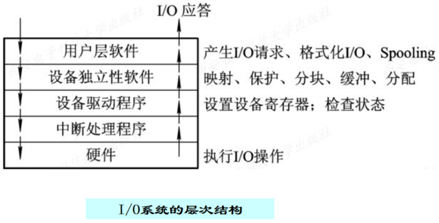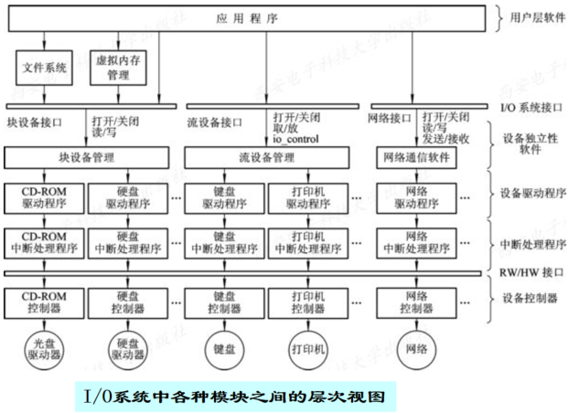

# 6.2 I/O设备和设备控制器
## 6.2.1 I/O设备
### 6.2.1.1 设备类型
* **按传输速率分**：低速设备(键盘)、中速设备(打印机)和高速设备(磁盘机)
* **按信息交换的单位分**：块设备(磁盘)和字符设备(如显示器，此类设备具有传输速率低、不可寻址、采用中断驱动方式等特征)
* **按设备的共享属性分**：
1. 独占设备：在一段时间内只允许一个用户访问的设备，如打印机
2. 共享设备：在一段时间内允许多个用户同时访问的设备，如磁盘
3. 虚拟设备：是指通过虚拟技术将一台物理设备变换成的若干台逻辑设备
### 6.2.1.2 设备与控制器之间的接口
*  设备不直接与CPU通信，而是与设备控制器通过其间的接口通信
* 接口中的信号有**数据信号**、**控制信号**、**状态信号**

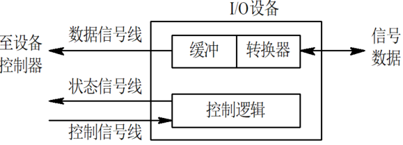

## 6.2.2 设备控制器
### 6.2.2.1 功能
* 可以控制多个 I/O 设备
* 是 CPU 与 I/O 设备之间的接口
* 接收从 CPU 发出的命令去控制 I/O 设备工作
* 设备状态的了解和报告
* 数据缓冲
* 差错控制
### 6.2.2.2 组成
* 设备控制器与处理机的接口
* 设备控制器与设备的接口
* I/O 逻辑

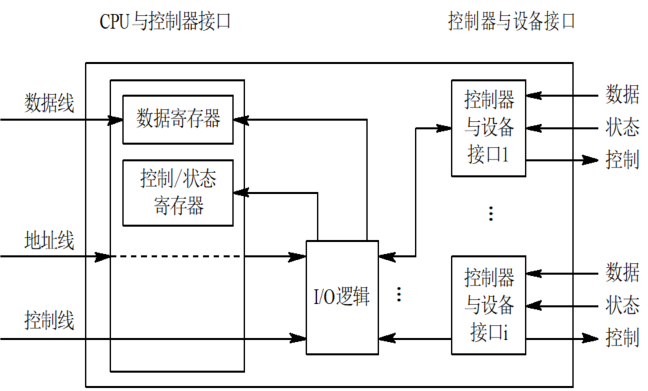

### 6.2.2.3 分类（由其控制设备）
* 用于控制字符设备的控制器
* 用于控制块设备的控制器
## 6.2.3 I/O通道
* 通道是一种特殊的处理机，其特殊性表现为:
	1. 指令类型单一
	2. 没有自己的内存(一般共享使用主存内存)
### 6.2.3.1 类型
* 字节多路通道(多台低速设备)
* 数组选择通道(一台高速设备)
* 数组多路通道(多台高速设备)

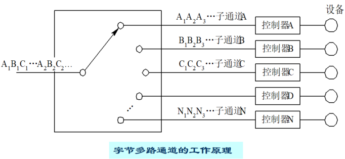

### 6.2.3.2 “瓶颈”问题
* 指由于通道数量不足而使 I/O 效率降低，进而造成整个系统吞吐量的下降。其解决的有效方法是**增加设备到主机间的通路，而不增加通道**
# 6.3 中断处理程序的处理过程

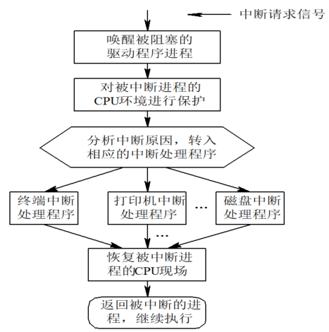

# 6.4 设备驱动程序
## 6.4.1 概述
### 6.4.1.1 功能
* 将接收到的抽象要求转换为具体要求
* 检查 I/O 请求的合法性，了解 I/O 设备的状态传递参数，设置设备的工作方式
* 发出 I/O 命令，启动 I/O 设备，完成 I/O 操作
* 及时响应由控制器或通道发来的 I/O 请求并进行处理
* 对设置有通道的系统，驱动程序根据用户的 I/O 请求可自动构成通道程序
### 6.4.1.2 特点
* 是在请求 I/O 的进程与设备控制器之间的一个通信程序
* 与 I/O 设备的特性紧密相关
* 与 I/O 控制方式紧密相关
* 一部分程序用汇编语言编写，基本部分固化在 ROM 中
### 6.4.1.3 设备处理方式
* 为每一类设备设置一个进程，专门执行这类设备的 I/O 操作
## 6.4.2 处理过程
* 可分为两部分：**驱动 I/O 设备工作的驱动程序**；**处理 I/O 完成后工作的设备中断处理程序**
* 过程如下：
1. 将抽象要求转换为具体要求
2. 检查 I/O 请求的合法性
3. 读出和检查设备的状态
4. 传递必要的参数
5. 设置设备的工作方式
6. 启动 I/O 设备
## 6.4.3 对I/O设备的控制方式
### 6.4.3.1 程序I/O方式（使用轮询的可编程I/O方式）
* 早期的计算机系统无中断机构，又叫忙等待方式。因为无中断所以 CPU 必须等 I/O 完成之后再继续执行自己的任务，即它们是串行执行的
### 6.4.3.2 （中断驱动方式）使用中断的可编程I/O方式
* 当某进程要启动某个 I/O 设备工作时，便由 CPU 向相应的设备控制器发出一条 I/O 命令，然后**立即返回继续执行原来的任务**。设备控制器于是按照该命令的要求去控制指定 I/O 设备。此时，**CPU 与 I/O 设备并行操作**
### 6.4.3.3 直接存储器访问DMA控制方式
* 因为中断驱动方式下的 CPU **以字(节)为单位**对 I/O 进行干预，若将其用于块设备效率极低，所以引入 DMA 方式
* **DMA 的特点**：
>1. 数据传输的基本单位是数据块
>2. 数据在设备与内存之间直接传递，不需经过 CPU
>3. 仅在传送一个或多个数据块的开始和结束时才需 CPU 干预，其余均在控制器的控制下完成
* **DMA 控制器的组成**：DMA 控制器与主机的接口、DMA 控制器与块设备的接口、I/O 控制逻辑
* 在 DMA 控制器实现成块数据直接交换需设置**四类寄存器**：
>(1)命令/状态寄存器     CR 
>(2)内存地址寄存器       MAR 
>(3)数据寄存器              DR 
>(4) 数据计数器             DC

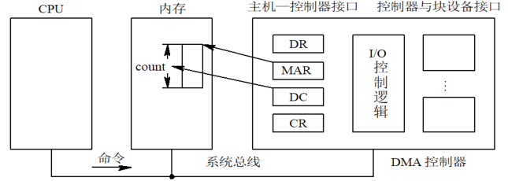

### 6.4.3.4 I/O通道控制方式
* 因为 DMA 方式下，CPU 每发出**一条 I/O 指令**只能去**读(写)一个连续的数据块**，当一次需要去读多个离散的数据块并分别送入不同的内存区域时，则需进行多次中断处理。I/O 通道方式把 CPU 的干预由**一个数据块减少为一组数据块**，并可以实现 **CPU、通道、I/O 设备三者的并行**工作
* **通道程序**：由一系列通道指令构成，一条通道指令一般包括以下信息：
>a. 操作码
   b. 内存地址
   c. 计数
   d. 通道程序结束位P 
   e. 记录结束标志R
### 6.4.3.5 比较

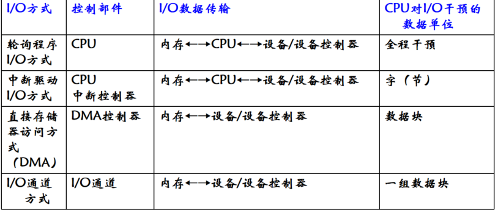

# 6.5 与I/O设备无关的软件
## 6.5.1 基本概念
* 应用程序独立于具体使用的物理设备叫设备独立性，也称为**设备无关性**
* 应用程序中， 使用**逻辑设备**名称来请求使用某类设备；而系统在实际执行时， 还必须使用**物理设备**名称。因此，系统须具有将逻辑设备名称转换为某物理设备名称的功能
* **优点**：设备分配时的灵活性、易于实现 I/O 重定向
## 6.5.2 软件功能
* 执行所有设备的公有操作：
	1. 对独立设备的分配与回收
	2. \* 将逻辑设备名映射为物理设备名，进一步可以找到相应物理设备的驱动程序
	3. 对设备进行保护，禁止用户直接访问设备
	4. 缓冲管理
	5. 差错控制
* 向用户层(或文件层)软件提供统一接口
## 6.5.3 设备分配
### 6.5.3.1 设备分配中的数据结构

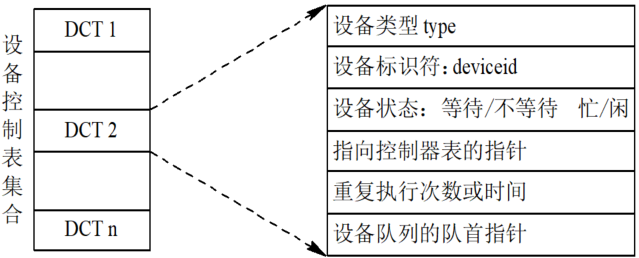
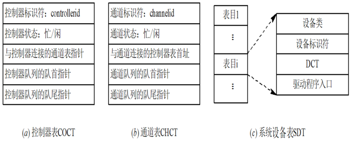

### 6.5.3.2 设备分配时应考虑的因素
1. 设备的固有属性： 独享设备、共享设备、虚拟设备
2. 设备的分配算法：先来先服务、优先级高者优先
3. 设备分配中的安全性：安全分配方式、不安全分配方式
### 6.5.3.3 独占设备的分配程序
1. 基本的设备分配程序：分配设备、分配控制器、分配通道
2. 设备分配程序的改进：增加设备的独立性、考虑多通路情况
# 6.6 用户层的I/O软件
## 假脱机（SPOOLing）系统
* **定义**：是用于将一台独占设备改造成共享设备的一种技术
* 组成：
>输入井和输出井(模拟两块磁盘)
>输入缓冲区和输出缓冲区(内存中开辟)
>输入进程和输出进程(模拟外围机操作)
>井管理进程(控制作业与磁盘井之间的信息交换)

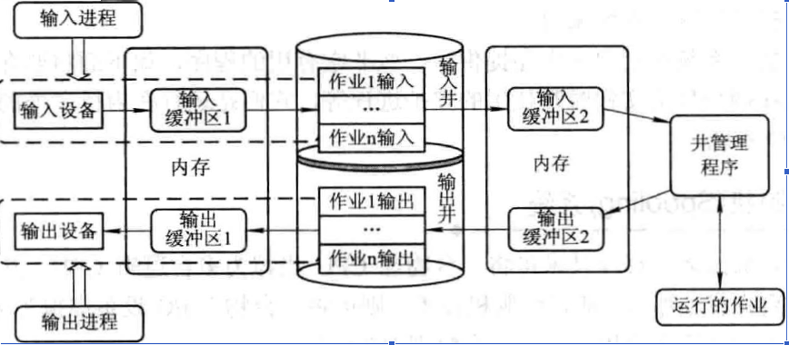

* 特点：
	1. 提高了 I/O 的速度
	2. 将独占设备改造为共享设备
	3. 实现了虚拟设备功能
# 6.7 缓冲区管理
* 出现原因：
	1. 为了缓和 CPU 与 I/O 设备间速度不匹配的矛盾
	2. 为了减少对 CPU 的中断频率， 放宽对 CPU 中断响应时间的限制
	3. 为了解决数据粒度不匹配的问题
	4. 为了提高 CPU 和 I/O 设备之间的并行性
## 6.7.1 单缓冲区
* **工作流程**：
	1. 设备(通过通道)将一整块数据读入该缓冲区
	2. 设备读完后，通知 CPU 来缓冲区取走数据并处理
	3. 在 CPU **处理完这块数据之前**，设备不得再往这个缓冲区里写新数据，必须空等

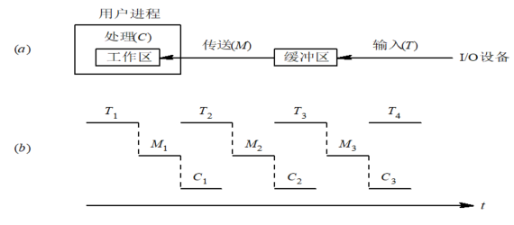

* 每一块数据的处理时间表示为：Max( T , C )+M
## 6.7.2 双缓冲区
* **工作流程**：
	1. **初始阶段**：设备将第一块数据读入 buffer1。此时 buffer2 空
	2. **并行阶段**：buffer1 装满后，通道**立即切换**，将第二块数据读入 buffer2；与此同时，CPU 立刻开始处理 buffer1 中的数据
	3. **切换与继续**：CPU 处理完 buffer1，若 buffer2 也恰好装满，则 CPU 处理 buffer2，通道转去装填 buffer1

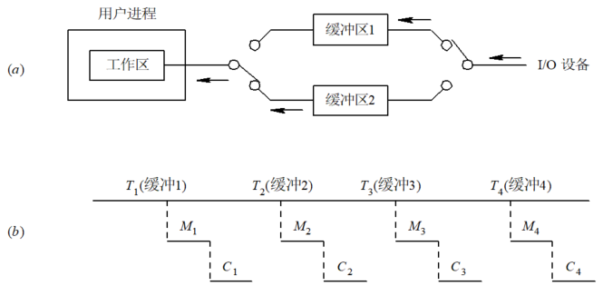

* 处理一块数据的处理时间粗略认为：Max( T , C )
## 6.7.3 环形缓冲区
* 组成： 多个缓冲区、多个指针
* 环形缓冲区的使用：Getbuf 过程、Releasebuf 过程

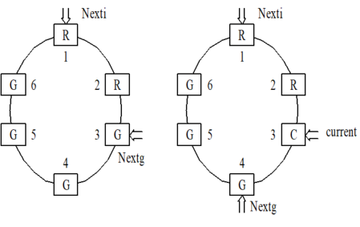

* Getbuf 和 Putbuf

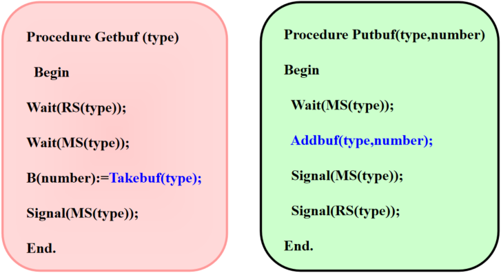

## 6.7.4 缓冲池
组成：
* 空缓冲队列    emq
* 输入队列        inq
* 输出队列        outq
* 用于收容输入数据的工作缓冲区    hin
* 用于提取输入数据的工作缓冲区    sin
* 用于收容输出数据的工作缓冲区    hout
* 用于提取输出数据的工作缓冲区    sout
工作方式：
* 收容输入工作方式
* 收容输出工作方式
* 提取输入工作方式
* 提取输出工作方式

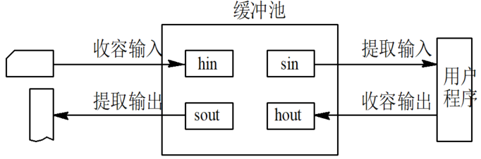

# 6.8 磁盘存储器的性能和调度
## 6.8.1 磁盘性能简述
* **数据组织**：一般说来，磁盘由一个或多个同轴驱动的盘片组成，每片为双面，每面又可划分成多个磁道，每个磁道再划分成多个扇区，每个扇区可称为一个物理块，并有一个标识符字段和一个数据字段，后者可存放大约 512 字节的数据(二进制)信息
* **磁盘类型**：
>1. **固定头磁盘**：在每条磁道上都有一读/写磁头，所有的磁头都被装在一刚性磁臂中。通过这些磁头可访问所有各磁道，并进行并行读/写，有效地提高了磁盘的 I/O 速度。 这种结构的磁盘主要用于大容量磁盘上
>2.**移动头磁盘**：每一个盘面仅配有一个磁头，也被装入磁臂中。为能访问该盘面上的所有磁道，该磁头必须能移动以进行寻道。可见，移动磁头仅能以串行方式读/写，致使其 I/O 速度较慢；但由于其结构简单， 故仍广泛应用于中小型磁盘设备中
* **磁盘访问时间**：寻道时间、旋转延迟时间、传输时间
## 6.8.2 磁盘调度
### 6.8.2.1 先来先服务FCFS
* 按进程提出访问的先后次序予以服务
### 6.8.2.2 最短寻道时间优先SSTF
* 每次从等待队列中选择要访问的**目标磁道距当前的磁头最近的进程**予以服务。该方法使**磁头的移动距离最近**，以使每次的**寻道时间最短**，虽可优于 FCFS，但**不能保证平均寻道时间最短**(可能会出现饥饿现象)
### 6.8.2.3 扫描（SCAN）算法
* 规定磁头的移动方向总是从内及外，然后从外及内，循环往复，每次**只服务于那些在磁头前进方向上**且**离当前磁头位置最近提出访问**的进程，又称电梯调度算法
* **注意**：此处的内外磁道并不是指实际物理上的最内最外磁道，而是指本次进程访问的最内最外磁道
### 6.8.2.4 循环扫描（CSCAN）算法
* 规定磁头只在一个方向上处理请求，反向移动时只是快速返回，不服务任何请求( SCAN 算法 plus )
### 6.8.2.5 N-Step-SCAN算法
* 算法思想：
	1. 将磁盘请求队列分成若干个长度为N的子队列
	2. 磁盘调度将按FCFS算法依次处理这些子队列
	3. 每处理一个队列时按SCAN算法，对一个队列处理完后，再处理其他队列
	4. 当正在处理某子队列时，如果又出现新的磁盘I/O请求，便将新请求进程放入其他队列
### 6.8.2.6 FSCAN算法
* FSCAN 只将磁盘请求队列分成两个子队列。**一个是由当前所有请求磁盘 I/O 的进程形成的队列**，由磁盘调度按 SCAN 算法进行处理。在扫描期间，将**新出现的所有请求磁盘 I/O 的进程， 放入另一个等待处理的请求队列**。这样，所有的新请求都将被推迟到下一次扫描时处理
