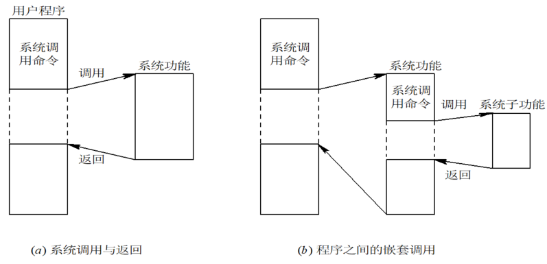

# 9.1 系统调用的基本概念

> 知识库入口：[操作系统基础知识库](操作系统基础知识库.md)

> 关联：系统调用是用户程序进入 OS 服务的入口，进程控制类调用对应[进程控制](2.进程的描述与控制.md#2.3%20进程控制)，文件操纵类调用对应[文件管理](7.文件管理.md)，通信类调用对应[进程通信](2.进程的描述与控制.md#2.7%20进程通信)。

* **概念**：指用户在程序中调用 OS 所提供的一些子功能，以获得其服务。是一种特殊的过程调用
* **特殊性**：
1. **运行在不同的系统状态**：调用过程运行在用户态，被调用过程运行在系统态。(特权指令、非特权指令)
2. **通过中断进入**：由于调用和被调用过程所出的状态不同，不允许由调入过程直接转入被调入过程，需通过中断进入 OS 核心，经分析后才转入相应的命令处理程序
3. **返回问题**：在可剥夺调度方式下，被调用过程执行完后，有可能被优先权更高的进程抢占处理机，而把调用过程插入就绪队列
4. **嵌套调用**：在一个被调用过程的执行期间，可以再利用系统调用命令去调用另一系统过程

# 9.2 系统调用的类型
## 9.2.1 进程控制类系统调用
1. 创建和终止进程的系统调用
2. 获得和设置进程属性的系统调用
3. 等待某事件出现的系统调用
## 9.2.2 文件操纵类系统调用
1. 创建和删除文件
2. 打开和关闭文件
3. 读和写文件
## 9.2.3 进程通信
1. 获得消息队列
2. 发送消息
3. 接收消息
还有：设备管理类系统调用、信息维护类系统调用等等
