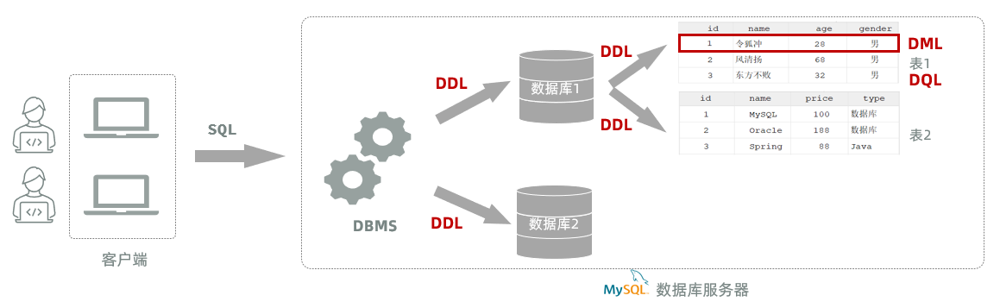

**SQL**：结构化查询语言。一门操作关系型数据库的编程语言，定义操作所有关系型数据库的统一标准。SQL语句根据其功能被分为四大类：DDL、DML、DQL、DCL 

| 分类                              | 说明                                                   |
|:--------------------------------- |:------------------------------------------------------ |
| DDL（Data Definition Language）   | 数据定义语言，用来定义数据库对象(数据库，表，字段)     |
| DML（Data Manipulation Language） | 数据操作语言，用来对数据库表中的数据进行增删改         |
| DQL（Data Query Language）        | 数据查询语言，用来查询数据库中表的记录                 |
| DCL（Data Control Language）      | 数据控制语言，用来创建数据库用户、控制数据库的访问权限 |


# 一、DDL语句
## 1、数据库操作
### （1）查询数据库
- 查询所有数据库
```SQL
show databases;
```
- 查询当前数据库
```SQL
select database();
```
### （2）创建数据库
```SQL
create database [ if not exists ] 数据库名  [default charset utf8mb4];
```
- 创建数据库时，可以不指定字符集。 因为在MySQL8版本之后，默认的字符集就是 utf8mb4
>注意：在同一个数据库服务器中，不能创建两个名称相同的数据库，否则将会报错
- 可以使用`if not exists`来避免这个问题
```SQL
-- 数据库不存在,则创建该数据库；如果存在则不创建
create database if not exists itcast; 
```
### （3）使用数据库
```SQL
use 数据库名 ;
```
- 我们要操作某一个数据库下的表时，就需要通过该指令，切换到对应的数据库下，否则不能操作
### （4）删除数据库
```SQL
drop database [ if exists ] 数据库名 ;
```
- 如果删除一个不存在的数据库，将会报错
- 可以加上参数 if exists ，如果数据库存在，再执行删除，否则不执行删除
>在 MySQL 中所有的 database，也可以替换成 schema
## 2、表操作
### （1）创建表
```SQL
create table  表名(
        字段1  字段1类型 [约束]  [comment  字段1注释 ],
        字段2  字段2类型 [约束]  [comment  字段2注释 ],
        ......
        字段n  字段n类型 [约束]  [comment  字段n注释 ] 
) [ comment  表注释 ] ;
```
- 注意： [ ] 中的内容为可选参数； 最后一个字段后面没有逗号
### （2）约束
- **概念**：所谓约束就是作用在表中字段上的规则，用于限制存储在表中的数据
- **作用**：就是来保证数据库当中数据的正确性、有效性和完整性
- 在MySQL数据库当中，提供了以下5种约束：

>注意：约束是作用于表中字段上的，可以在创建表/修改表的时候添加约束

**主键自增：auto_increment**：
- 每次插入新的行记录时，数据库自动生成id字段(主键)下的值
- 具有auto_increment的数据列是一个正数序列开始增长(从1开始自增)
### （3）数据类型
- MySQL中的数据类型有很多，主要分为三类：数值类型、字符串类型、日期时间类型。


- char 与 varchar 都可以描述字符串，char是定长字符串，指定长度多长，就占用多少个字符，和字段值的长度无关 。而varchar是变长字符串，指定的长度为最大占用长度 。相对来说，char的性能会更高些

### （4）查、改、删
- 查询数据库表的具体的语法：
```SQL
-- 查询当前数据库的所有表
show tables;
-- 查看指定的表结构
desc 表名 ;   -- 可以查看指定表的字段、字段的类型、是否可以为NULL、是否存在默认值等信息
-- 查询指定表的建表语句
show create table 表名 ;
```
- 修改数据库表表结构的具体语法：
添加字段
```SQL
-- 添加字段
alter table 表名 add  字段名  类型(长度)  [comment 注释]  [约束];
-- 比如： 为tb_emp表添加字段qq，字段类型为 varchar(11)
alter table tb_emp add  qq  varchar(11) comment 'QQ号码';
```
修改字段
```SQL
-- 修改字段类型
alter table 表名 modify  字段名  新数据类型(长度);

-- 比如： 修改qq字段的字段类型，将其长度由11修改为13
alter table tb_emp modify qq varchar(13) comment 'QQ号码';
```
```SQL
-- 修改字段名，字段类型
alter table 表名 change  旧字段名  新字段名  类型(长度)  [comment 注释]  [约束];

-- 比如： 修改qq字段名为 qq_num，字段类型varchar(13)
alter table tb_emp change qq qq_num varchar(13) comment 'QQ号码';
```
删除字段
```SQL
-- 删除字段
alter table 表名 drop 字段名;
-- 比如： 删除tb_emp表中的qq_num字段
alter table tb_emp drop qq_num;
```
修改表名
```SQL
-- 修改表名
rename table 表名 to  新表名;
-- 比如: 将当前的emp表的表名修改为tb_emp
rename table emp to tb_emp;
```
删除表结构
```SQL
-- 删除表
drop  table [ if exists ]  表名;

-- 比如：如果tb_emp表存在，则删除tb_emp表
drop table if exists tb_emp;  -- 在删除表时，表中的全部数据也会被删除。
```
>关于表结构的查看、修改、删除操作，工作中一般都是直接基于图形化界面操作

# 二、DML语句
## 1、增加（insert）
- 向指定字段添加数据
```SQL
insert into 表名 (字段名1, 字段名2) values (值1, 值2);
```
- 全部字段添加数据
```SQL
insert into 表名 values (值1, 值2, ...);
```
- 批量添加数据（指定字段）
```SQL
insert into 表名 (字段名1, 字段名2) values (值1, 值2), (值1, 值2);
```
- 批量添加数据（全部字段）
```SQL
insert into 表名 values (值1, 值2, ...), (值1, 值2, ...);
```
**insert操作的注意事项：**
1. 插入数据时，指定的字段顺序需要与值的顺序是一一对应的。
2. 字符串和日期型数据应该包含在引号中。
3. 插入的数据大小，应该在字段的规定范围内。
## 2、修改（updat）

```SQL
update 表名 set 字段名1 = 值1 , 字段名2 = 值2 , .... [where 条件] ;
```
**注意事项:**
1. 修改语句的条件可以有，也可以没有，如果没有条件，则会修改整张表的所有数据。
2. 在修改数据时，一般需要同时修改公共字段update_time，将其修改为当前操作时间。
## 3、删除（delete）

```SQL
delete from 表名  [where  条件] ;
```
**注意事项:**
- DELETE 语句的条件可以有，也可以没有，如果没有条件，则会删除整张表的所有数据。
- DELETE 语句不能删除某一个字段的值(可以使用UPDATE，将该字段值置为NULL即可)。
- 当进行删除全部数据操作时，会提示询问是否确认删除所有数据，直接点击Execute即可。
# 三、DQL语句
**查询关键字：select**
## 1、语法
```SQL
select
        字段列表
from
        表名列表
where
        条件列表
group  by
        分组字段列表
having
        分组后条件列表
order by
        排序字段列表
limit
        分页参数
```
## 2、基本查询
- 查询多个字段
```SQL
select 字段1, 字段2, 字段3 from 表名;
```
- 查询所有字段（通配符 * ）
```SQL
select * from 表名;
```
 > * 号代表查询所有字段，在实际开发中尽量少用（不直观、影响效率）
- 设置别名（ as 可以不加）
```SQL
select 字段1 [ as 别名1 ] , 字段2 [ as 别名2 ]  from  表名;
```
- 去除重复记录
```SQL
select distinct 字段列表 from  表名;
```
## 3、条件查询
```SQL
select  字段列表  from   表名   where   条件列表 ; -- 条件列表：意味着可以有多个条件
```
学习条件查询就是学习条件的构建方式，而在SQL语句当中构造条件的运算符分为两类：
- 比较运算符
- 逻辑运算符
常用的比较运算符如下：

常用的逻辑运算符如下：

- **注意**：查询为NULL的数据时，不能使用 `= null` 或 `！=null` 。得使用 `is null` 或 `is not null`
通配符 "\_" 下划线 代表任意1个字符使用 “\_” 之后此位置一定会有一个字符
通配符 "%" 代表任意个字符（0个 ~ 多个）
换码字符 由 escape 短语指定 eg：
``` sql
selcet * from Course where Cname like 'DB$_%i__' escape '$';
```
## 4、聚合函数
之前我们做的查询都是横向查询，就是根据条件一行一行的进行判断，而使用聚合函数查询就是纵向查询，它是对一列的值进行计算，然后返回一个结果值。（将一列数据作为一个整体，进行纵向计算）
常用聚合函数：

- **注意** : 聚合函数会忽略空值，对NULL值不作为统计。
- count（ \[distinct | all ] <列名> / * ）：按照列去统计有多少行数据。
    - 在根据指定的列统计的时候，如果这一列中有null的行，该行不会被统计在其中。
- sum（ \[distinct | all ] <列名> ）：计算指定列的数值和，如果不是数值类型，那么计算结果为0
- max（ \[distinct | all ] <列名> ）：计算指定列的最大值
- min（ \[distinct | all ] <列名> ）：计算指定列的最小值
- avg（ \[distinct | all ] <列名> ）：计算指定列的平均值
`distinct：在计算时要取消指定列中的重复值`
`all：不取消重复值（为缺省值）`
## 5、分组查询
- 分组： 按照某一列或者某几列，把相同的数据进行合并输出。
    - 分组其实就是按列进行分类(指定列下相同的数据归为一类)，然后可以对分类完的数据进行合并计算。
    - 分组查询通常会使用聚合函数进行计算。
```SQL
select  字段列表  from  表名  [where 条件]  group by 分组字段名  [having 分组后过滤条件];
```
**注意事项**：
- 分组之后，查询的字段一般为聚合函数和分组字段，查询其他字段无任何意义
- 执行顺序：where > 聚合函数 > having
**where与having区别（面试题）**：
- 执行时机不同：where是分组之前进行过滤，不满足where条件，不参与分组；而having是分组之后对结果进行过滤。
- 判断条件不同：where不能对聚合函数进行判断，而having可以。
## 6、排查查询
```SQL
select  字段列表  
from   表名   
[where  条件列表] 
[group by  分组字段 ] 
order  by  字段1  排序方式1 , 字段2  排序方式2 … ;
```
- 排序方式：
    - asc ：升序（默认值）
    - desc：降序
**注意事项**：
- 如果是升序, 可以不指定排序方式ASC
- 如果是多字段排序，当第一个字段值相同时，才会根据第二个字段进行排序
## 7、分页查询
```SQL
select  字段列表  from  表名  limit  起始索引, 查询记录数 ;
```
**注意事项**：
1. 起始索引从0开始。 计算公式 ：起始索引 = （查询页码 - 1）* 每页显示记录数
2. 分页查询是数据库的方言，不同的数据库有不同的实现，MySQL中是LIMIT
3. 如果查询的是第一页数据，起始索引可以省略，直接简写为 limit 条数
# 四、多表查询
## 1、物理外键和逻辑外键
- 物理外键
    - 概念：使用foreign key定义外键关联另外一张表。
    - 缺点：
        - 影响增、删、改的效率（需要检查外键关系）。
        - 仅用于单节点数据库，不适用于分布式、集群场景。
        - 容易引发数据库的死锁问题，消耗性能。

- 逻辑外键
    - 概念：在业务层逻辑中，解决外键关联。
    - 通过逻辑外键，就可以很方便的解决上述问题。
## 2、分类：
### （1）连接查询
- 内连接：相当于查询A、B交集部分数据
- 外连接
    - 左外连接：查询左表所有数据（包括两张表交集部分数据）
    - 右外连接：查询右表所有数据（包括两张表交集部分数据）
### （2）子查询
## 3、内连接
- 查询两表或多表中交集部分数据
- 语法上分为**隐式内连接**和**显示内连接**
**隐式内连接语法：**
```SQL
select  字段列表   from   表1 , 表2   where  条件 ... ;
```
**显式内连接语法：**
```SQL
select  字段列表   from   表1  [ inner ]  join 表2  on  连接条件 ... ;
```
- 在多表联查时，我们指定字段时，需要在字段名前面加上表名（可以起别名），来指定具体是哪一张的字段
- **注意事项:** 一旦为表起了别名，就不能再使用表名来指定对应的字段了，此时只能够使用别名来指定字段。
## 4、外连接
**左外连接语法：**
```SQL
select  字段列表   from   表1  left  [ outer ]  join 表2  on  连接条件 ... ;
```
- 左外连接相当于查询表1(左表)的所有数据，当然也包含表1和表2交集部分的数据

**右外连接语法：**
```SQL
select  字段列表   from   表1  right  [ outer ]  join 表2  on  连接条件 ... ;
```
- 右外连接相当于查询表2(右表)的所有数据，当然也包含表1和表2交集部分的数据
## 5、子查询（嵌套查询）
- SQL语句中嵌套select语句
```SQL
SELECT  *  FROM   t1   WHERE  column1 =  ( SELECT  column1  FROM  t2 ... );
```
- 子查询外部的语句可以是insert / update / delete / select 的任何一个，最常见的是 select
- 根据子查询结果的不同分为：
	1. 标量子查询（子查询结果为单个值：一行一列）
	2. 列子查询（子查询结果为一列，但可以是多行）
	3. 行子查询（子查询结果为一行，但可以是多列）
	4. 表子查询（子查询结果为多行多列：相当于子查询结果是一张表）
- 子查询可以书写的位置：
	1. where之后
	2. from之后
	3. select之后
### （1）标量子查询
- 子查询返回的结果是单个值（数字、字符串、日期等），最简单的形式
常用的操作符：=、<>、>、>=、<、<=
### （2）列子查询

### （3）行子查询
常用的操作符：= 、<> 、IN 、NOT IN
### （4）表子查询
一般作为临时表使用（一次性的）
# 五、索引
- 建立索引是加快查询速度的有效手段
>部分DBMS会在 primary key、unique 自动建立索引

- 维护和使用索引都是DBMS自动完成和决定的
创建索引语句格式：
``` sql
create [unique] [cluster] index <索引名> on <表名> (<列名>[<次序>][,<列名>[<次序>] ]…)
```
- 用 **<表名>** 指定要建索引的基本表名字
- 索引可以建立在该表的一列或多列上，各列名之间用逗号分隔
- 用 **<次序>** 指定索引值的排列次序，升序：ASC，降序：DESC。缺省值：ASC
- **unique** 表明此索引的每一个索引值只对应唯一的数据记录
- **cluster** 表示要建立的索引是聚簇索引
删除索引语句格式：
``` sql
drop index <索引名>
```
- 删除索引时，系统会从数据字典中删去有关该索引的描述
- **聚簇索引**：一般采用B+树组织索引数据，非叶子节点只保存索引值和索引指针，叶子节点**保存实际数据**。叶子节点之间有指针，方便范围查询
- **非聚簇索引**：一般采用B+树组织索引数据，非叶子节点只保存索引值和索引指针，叶子节点**保存实际数据的逻辑指针**。叶子节点之间有指针，方便范围查询
# 六、数据字典
- 关系数据库管理系统内部的一组系统表，它记录了数据库中所有定义信息：
> 关系模式定义、视图定义、索引定义、完整性约束定义、各类用户对数据库的操作权限、统计信息等
- 关系数据库管理系统在执行SQL的数据定义语句时，实际上就是在更新数据字典表中的相应信息