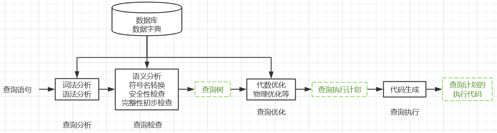

# 4.1 查询处理

> 知识库入口：[数据库原理知识库](数据库原理知识库.md)

> 关联：查询优化承接 [SQL 数据查询](3.关系数据库标准语言SQL.md#3.2%20数据查询)，其逻辑优化依赖[关系代数](2.关系数据库.md#2.4%20关系代数)，物理优化依赖存取路径和连接算法选择。

## 4.1.1 基本步骤

## 4.1.2 算法操作
### 4.1.2.1 嵌套循环方法
两重循环：外循环扫描表 1 ，内循环扫描表 2
### 4.1.2.2 排序合并法
执行过程：先按连接属性对表进行排序，先扫描表 1，当遇到表 2 中第一条大于表 1 连接字段值的元组时，对表 2 的查询不再继续。表 1 的第二条元组，从刚才的中断处继续扫描表 2
>常用于“=”连接
### 4.1.2.3 索引连接
执行过程：对表 2 按连接字段建立索引，对表 1 中的每个元组，依次根据其连接字段值查询表 2 的索引，从中找到满足条件的元组
### 4.1.2.4 Hash Join方法
执行过程：通常选择较小的表先建立 Hash 表，在对另一张表进行探测匹配
>处理**等值连接**的算法，适合其中一个能一次性读入内存
# 4.2 查询优化
* **定义**：是 DBMS 根据用户提交的 SQL 语句，自动选择一种执行**效率最高**的执行方案的过程
## 4.2.1 查询优化的必要性
1. 提高查询效率，主要目的
2. 尽可能地减少磁盘 I/O
3. 提高系统的吞吐量
4. 降低系统资源消耗，提高数据库整体性能
## 4.2.2 查询优化目标
* 在保证查询结果正确的前提下，选择代价( Cost )最小的执行计划
* 代价：CPU时间、I/O次数、内存消耗、网络传输、响应时间等
## 4.2.3 查询优化由DBMS自动进行的原因
1. 用户不用关心执行细节，用户只需要负责写查询语句就行
2. 数据库掌握的信息更多
3. 执行效率更高，DBMS 可以自动对比所有方案选出最好方案
4. 提高程序的可以移植性
# 4.3 代数优化（逻辑优化）
* **定义**：根据**关系代数**的**等价变换**规则，对查询树进行改写，在不改变查询结果的前提下，使执行效率更高
* 优化的是关系代数树，不是 SQL 本身
## 主要作用
1. 选择下推：尽早执行 where 条件，减少参与后续操作的数据量
2. 投影下推：尽早去除不需要的列，减少数据传输
3. 连接顺序优化：优先连接较小的关系，减少中间结果
4. 消除冗余操作：删除重复或无意义的关系代数操作
## 特点
- 不涉及具体算法
- 不涉及索引
- 不涉及硬件资源
- 优化对象是关系代数表达式(查询树)
>所以：代数优化属于逻辑优化
# 4.4 物理优化（执行优化）
* **定义**：在代数优化之后，根据系统统计信息和代价估算，为每一步操作选择代价最小的物理执行算法
* 再此优化过程中最重要的就是**考虑数据库底层资源**，例如：有没有索引、数据多少、内存多少、CPU 、I/O 等
## 主要作用
1. 选择访问路径：全表扫描或索引扫描
2. 选择连接算法：嵌套循环连接、排序归并连接、Hash Join
3. 选择排序算法：内排序或外排序
4. 利用索引和统计信息估算执行代价，生成最优执行计划
## 特点
* 需要考虑索引、内存、CPU 和磁盘 I/O
* 以执行代价( Cost )最小为目标
* 优化对象是具体的执行计划
## 代数优化和物理优化的区别
* 代数优化解决的是"执行顺序如何安排更合理"，属于逻辑层面的优化
* 物理优化解决的是"每一步具体采用什么算法执行"，属于实现层面的优化
