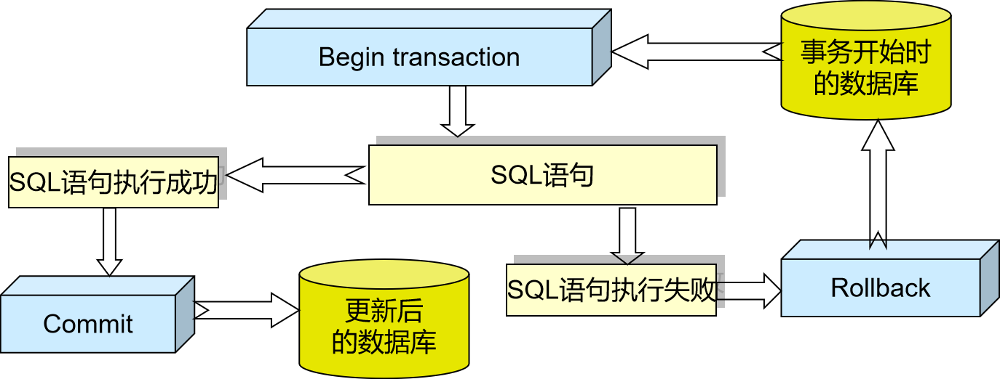

# 5.1 事务的基本概念

> 知识库入口：[数据库原理知识库](数据库原理知识库.md)

> 关联：恢复技术主要保障事务的原子性和持久性；事务的隔离性和并发正确性见[并发控制](6.并发控制.md)。

* **定义**：用户定义的一个数据库操作序列，这些操作要么全做，要么全不做，是一个不可分割的工作单位。同时也是一个逻辑工作单位，数据库处理的逻辑单元，事务必须完整地执行，以保证它的正确性
## 5.1.1 事务的特性（ACID）
* **执行的原子性( Atomic )**：这些操作要么都做，要么都不做。事务是一个不可分割的工作单位
* **功能上的一致性( Consistency )**：对数据库的作用从一个一致状态转变为另一个一致状态
* **彼此的隔离性( Isolation )**：若多个事务并发地执行，执行结果应该像各个事务独立地执行一样
* **作用的持续性( Durability )**：一个成功的执行的事务对数据库的影响是持久的，即使数据库因故障受到破坏，DBMS 也应能恢复
## 5.1.2 事务控制流程
* **隐式定义事务方式**：指当用户没有显式地定义事务时，DBMS 按缺省规定自动划分事务
* **显式定义事务方式**：
``` sql
begin -- 或者 start transaction
	SQL语句 1
	SQL语句 2
	...
commit -- 或者 rollback
```
* **commit**：事务正常结束，并提交事务的所有操作，事务中所有对数据库的更新写回磁盘上的物理数据库中
* **rollback**：事务异常结束，指事务运行的过程中发生了故障，不能继续执行，后系统将事务中对数据库的所有已完成的操作全部撤销。事务滚回到开始时的状态



# 5.2 故障的种类
## 5.2.1 事务故障（Transaction Failure）
* **定义**：事务在执行过程中，由于某种原因**没有正常完成**，只能终止并撤销(回滚)
* **常见原因**：
	- 输入数据错误
	- 程序运行异常(如除零、数组越界)
	- 死锁，被数据库系统强制终止
	- 用户主动取消事务( rollback )
* **特点**：
	- **只有当前事务受到影响**
	- 数据库系统本身仍然正常运行
	- 需要执行 **Undo (撤销)** 操作，将该事务已经修改的数据恢复到事务开始之前的状态
## 5.2.2 系统故障（System Failure）
* **定义**：数据库管理系统运行过程中，由于整个系统突然停止工作，导致所有正在执行的事务都中断
* **常见原因**：
	- 突然断电
	- 操作系统崩溃
	- 数据库服务器宕机
	- 内存故障
* **特点**：
	- **影响所有正在执行的事务**
	- 外存中的数据库一般不会损坏，但内存中的数据会丢失
	- 恢复时需要根据日志进行：
	    - **Redo（重做)**：重新执行已经提交但尚未写入数据库的事务。
	    - **Undo（撤销)**：撤销尚未提交的事务。
## 5.2.3 介质故障
* **定义**：存放数据库的**外存介质(如硬盘、SSD )发生损坏**，导致数据库文件或日志文件丢失、损坏，无法正常读取
* **常见原因**：
	- 硬盘或SSD损坏
	- 磁盘坏道
	- 存储设备老化
	- 火灾、水灾等导致存储介质损毁
	- 病毒或人为误删除数据库文件
* **特点**：
	- **影响范围最大**，整个数据库可能无法使用。
	- 数据库文件和日志文件可能都受到影响。
	- 仅靠事务日志通常无法完全恢复数据。
	- 必须依靠数据库备份( Backup )和日志文件( Log )共同恢复。
# 5.3 恢复的实现技术
* **基本原理**：利用存储在系统别处的**冗余数据**来重建数据库中已被破坏或不正确的那部分数据
* **关键技术**：数据转存( backup )、登记日志文件( logging )
## 5.3.1 数据转存
* **定义**：指定期将数据库中的数据复制到其他存储设备上保存，形成数据库的备份。如果数据库损坏，就可以利用备份恢复，即介质故障主要依靠数据转储恢复
### 5.3.1.1 静态转储（Static Backup）
* 静态转储是在**数据库停止运行时**进行备份。
* 过程：停止数据库 -> 复制整个数据库 -> 备份完成 -> 重新开放数据库
* **优点**：数据一致、备份简单
* **缺点**：必须停止数据库、用户不能访问数据库
### 5.3.1.2 动态转储（Dynamic Backup）
* 动态转储是在**数据库运行过程中**进行备份。
* 备份期间：数据库不会停止运行，用户仍然正常的使用数据库进行查询和修改数据
* **优点**：不影响正常使用，适合大型数据库
* **缺点**：实现复杂，必须配合日志文件才能保证恢复正确
### 5.3.1.3 转储方式
* **海量转储**：每次转储全部数据库
* **增量转储**：只转储上次转储后更新过的数据
* 从恢复角度看：使用海量转储得到的后备副本进行恢复往往更方便
* 从实用角度看：如果数据库很大，事务处理又十分频繁，则增量转储方式更实用更有效
## 5.3.2 登记日志文件
* **日志文件**：是数据库**专门记录数据库所有修改操作的文件**，会以**记录**或**数据块**为单位的日志文件，其中记录每个事务的开始、结束和其中的所有更新操作
### 5.3.2.1 基于记录的日志文件
* **存储内容**：
	* 事务标识
	* 操作类型(插入、删除或修改)
	* 操作对象(记录 ID、Block NO )
	* 更新前数据的旧值(对插入操作而言，此项为空值)
	* 更新后数据的新值(对删除操作而言, 此项为空值)
### 5.3.2.2 基于数据块的日志文件
* **存储内容**：
	* 事务标识(标明是那个事务)
	* 被更新的数据块
### 5.3.2.3 日志文件的用途
* 用于事务故障恢复和系统故障恢复
* 在动态转储方式中必须建立日志文件，后援副本和日志文件综合起来才能有效地恢复数据库
* 静态转储使用日志文件保证不丢失提交的事务
### 5.3.2.4 登记日志文件的原则
* 登记的次序严格按并行事务执行的时间次序
* 必须先写日志文件，后写数据库
# 5.4 恢复策略
## 5.4.1 事务故障的恢复
* 在此故障中，事务在运行至正常终止点前被中止。所有会由恢复子系统应利用日志文件撤消( UNDO )此事务已对数据库进行的修改，会由系统自动完成，不需要用户的干预
* **恢复步骤**：
	1. **反向扫描文件日志**：从最后向前扫描日志文件，查找该事务的更新操作
	2. **对该事务的更新操作执行逆操作**：将日志记录中“更新前的值”写入数据库
		   - 插入操作，“更新前的值”为空，则相当于做删除操作。  
		   - 删除操作，“更新后的值”为空，则相当于做插入操作。  
		   - 若是修改操作，则用修改前值代替修改后值。
	3. **继续反向扫描日志文件**：查找该事务的其他更新操作，并做同样处理
	4. **重复上述过程**：如此处理下去，直至读到此事务的开始标记，事务故障恢复就完成了
## 5.4.2 系统故障的恢复
* 系统故障造成数据库不一致状态的原因：
	* 一些未完成事务对数据库的更新已写入数据库
	* 一些已提交事务对数据库的更新还留在缓冲区没来得及写入数据库
* **恢复方法**：Undo 故障发生时未完成的事务、Redo 已完成的事务，也是由系统自动完成
* **恢复步骤**：
	1. **正向扫描日志文件**：从头扫描日志文件 
		   - Redo 队列：在故障发生前已经提交的事务
		   - Undo 队列：故障发生时尚未完成的事务
	2. 对 Undo 队列事务进行 UNDO 处理：**反向**扫描日志文件，对每个 UNDO 事务的更新操作执行逆操作
	3. 对 Redo 队列事务进行 REDO 处理：**正向**扫描日志文件，对每个 REDO 事务重新执行登记的操作
## 5.4.3 介质故障的恢步骤
1. 装入最新的后备数据库副本，使数据库恢复到最近一次转储时的一致性状态
	* 对于**静态转储**的数据库副本，装入后数据库即处于一致性状态
	* 对于**动态转储**的数据库副本，还须同时装入转储时刻的日志文件副本，利用与恢复系统故障相同的方法(即 REDO+UNDO )，才能将数据库恢复到一致性状态
2. 装入有关的日志文件副本，重做( REDO )已完成的事务
	* 首先扫描日志文件，找出故障发生时已提交的事务的标识，将其记入重做( REDO )队列
	* 然后正向扫描日志文件，对重做( REDO )队列中的所有事务进行重做处理。即将日志记录中“更新后的值”写入数据库
* 与事务故障和系统故障不同，介质故障需要 DBA 的介入，DBA主要负责：重装最近转储的数据库副本和有关的各日志文件副本，执行系统提供的恢复命令。具体的恢复操作还是由 DBMS 完成
# 5.5 具有检查点的恢复技术
* 这种技术是在普通日志恢复技术基础上的**一种优化方法**，它的目的是：减少数据库恢复所需的时间
## 5.5.1 检查点
* 是数据库在运行过程中**定期设置的一个“恢复标记”**
* 当数据库执行到检查点时，会做以下几件事：
	1. 将内存中已修改的数据写回磁盘
	2. 将日志缓冲区中的日志写入日志文件
	3. 在日志文件中写入一条**检查点记录（Checkpoint Record）**
>可以把检查点理解为：**数据库给自己保存了一个“安全存档点”**
* 检查点的主要作用就是减少查询事务故障的时间
## 5.5.2 恢复过程
发生系统故障后，数据库一般按以下步骤恢复：
1. 找到最近一次检查点
2. 分析检查点之后有哪些事务
3. 已提交的事务执行 Redo
4. 未提交的事务执行 Undo

这样就避免了从日志最开始恢复，大大提高了恢复效率
## 5.5.3 检查点技术的优点
- **减少恢复时间**，无需扫描全部日志
- **提高数据库恢复效率**
- **特别适合日志文件很大的数据库系统**
